# TDS Protocol Examples

> Source: [MS-TDS] v20260223, Chapter 4

Binary TDS messages with annotated hex dumps and XML decompositions from the specification.

---

## 42. Pre-Login Request (4.1)

Client → Server. Packet type 0x12.

```
12 01 00 2F 00 00 01 00  ; Header: type=0x12, status=EOM, length=47
```

### PreLogin Options

| Token | Offset | Length | Description |
|-------|--------|--------|-------------|
| 0x00 (VERSION) | 0x001A | 6 | Client version |
| 0x01 (ENCRYPTION) | 0x0020 | 1 | Encryption setting |
| 0x02 (INSTOPT) | 0x0021 | 1 | Instance name |
| 0x03 (THREADID) | 0x0022 | 4 | Thread ID |
| 0x04 (MARS) | 0x0026 | 1 | MARS support |
| 0xFF (TERMINATOR) | — | — | End of options |

### Option Data

```
VERSION:  09 00 00 00 00 00    ; 9.0.0.0 (SQL Server 2005)
ENCRYPTION: 01                 ; ENCRYPT_ON
INSTOPT:  00                   ; Default instance
THREADID: B8 0D 00 00          ; Thread 0x0DB8 = 3512
MARS:     01                   ; MARS enabled
```

---

## 43. Login Request (4.2)

Client → Server. Packet type 0x10 (Login7). TDS version 7.2 (0x02000972).

```
10 01 00 90 00 00 01 00  ; Header: type=0x10, status=EOM, length=144
```

### Login7 Fixed Fields

| Field | Hex | Value |
|-------|-----|-------|
| Length | 88 00 00 00 | 136 bytes |
| TDSVersion | 02 00 09 72 | TDS 7.2 |
| PacketSize | 00 10 00 00 | 4096 |
| ClientProgVer | 00 00 00 07 | 7 |
| ClientPID | 00 01 00 00 | 1 |
| OptionFlags1 | E0 | USE_DB_ON, INIT_DB_FATAL, SET_LANG_ON |
| OptionFlags2 | 03 | ODBC, Language_FATAL |
| TypeFlags | 00 | SQL login |
| OptionFlags3 | 00 | — |
| ClientLCID | 09 04 00 00 | 0x0409 (US English) |

### Offset/Length Pairs

| Field | ibOffset | cchLength | Decoded |
|-------|----------|-----------|---------|
| HostName | 0x5E | 8 | (8 chars) |
| UserName | 0x6E | 2 | "sa" |
| Password | 0x72 | 0 | (empty) |
| AppName | 0x72 | 7 | (7 chars) |
| ServerName | 0x80 | 0 | (empty) |
| CltIntName | 0x80 | 4 | (4 chars) |
| Database | 0x88 | 0 | (empty) |

### Data Section (UTF-16 LE)

```
Data: "s.k.o.n.t.o.s.1."  (HostName)
      "s.a."              (UserName)
      "O.D.B.C."          (CltIntName)
```

---

## 44. Login Request with Federated Auth (4.3)

Client → Server. Packet type 0x10. TDS version 7.4 (0x04000074).

```
10 01 08 10 00 00 01 00  ; Header: type=0x10, status=EOM, length=0x0810=2064
```

### Key Differences from Basic Login

| Field | Value | Note |
|-------|-------|------|
| TDSVersion | 04 00 00 74 | TDS 7.4 |
| OptionFlags3 | 10 | fExtension=1 |
| ibExtension | 0xB8 | Points to FeatureExt block |
| cbExtension | 4 | 4 bytes (offset to FeatureExt data) |

### FeatureExt Block

```
FeatureOpt:
  FeatureId:      02           ; FEDAUTH
  FeatureDataLen: 3E 07 00 00  ; 0x073E = 1854 bytes
  FeatureData:
    Options:        01         ; ADAL (Azure AD Authentication Library)
    FedAuthToken:   L_VARBYTE  ; Length=0x06E2, token bytes...
    SignedData:
      Nonce:        DF 31 12 79 58 7C 0F CD ...  (32 bytes)
      ChannelBindingToken: 74 6C 73 2D ... (channel binding)
      Signature:    0D 40 B2 1B 57 0E AB ...
TERMINATOR: FF
```

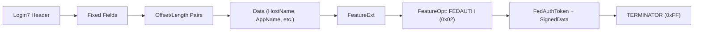

---

## 45. Login Response (4.4)

Server → Client. Packet type 0x04.

```
04 01 01 61 00 00 01 00  ; Header: type=0x04, status=EOM, length=353
```

### Token Stream

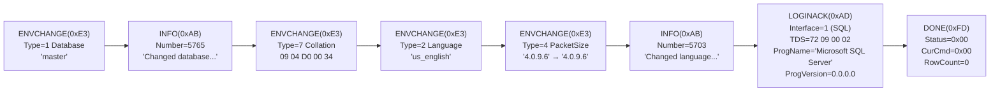

### ENVCHANGE Database (Type 1)

```
E3                ; Token type
1B 00             ; Length = 27
01                ; Type = 1 (Database)
06                ; NewValue length = 6 chars
6D 00 61 00 73 00 74 00 65 00 72 00  ; "master" (UTF-16 LE)
06                ; OldValue length = 6 chars
6D 00 61 00 73 00 74 00 65 00 72 00  ; "master"
```

### LOGINACK

```
AD                ; Token type
36 00             ; Length = 54
01                ; Interface = 1 (TSQL)
72 09 00 02       ; TDS version (server→client format: 7.2)
16                ; ProgName length = 22 chars
4D 00 69 00 63 00 72 00 6F 00 73 00 6F 00 66 00
74 00 20 00 53 00 51 00 4C 00 20 00 53 00 65 00
72 00 76 00 65 00 72 00 00 00 00 00  ; "Microsoft SQL Server...."
00 00 00 00       ; ProgVersion = 0.0.0.0
```

### DONE (Final)

```
FD                ; Token type
00 00             ; Status = 0x0000 (DONE_FINAL)
00 00             ; CurCmd = 0x0000
00 00 00 00 00 00 00 00  ; RowCount = 0
```

---

## 46. Login Response with FedAuth FeatureExtAck (4.5)

Server → Client. Packet type 0x04. Includes FEATUREEXTACK with FedAuth nonce+signature.

```
04 01 01 BC 01 4A 01 00  ; Header: type=0x04, status=EOM, length=444, SPID=0x014A
```

### Token Stream

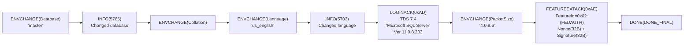

### FEATUREEXTACK

```
AE                ; Token type
  02              ; FeatureId = FEDAUTH
  40 00 00 00     ; FeatureAckDataLen = 64
  ; FeatureAckData:
    ; Nonce (32 bytes):
    C9 08 46 4E 58 49 0C 71 80 72 CD 69 F0 EC 3D E2
    F6 ED 75 8C 77 7D 9C B8 BB 87 4A 9C 90 80 A4 EE
    ; Signature (32 bytes):
    40 B6 07 71 0E A8 3C 0E D7 DE 14 DE F3 8B 65 C2
    06 8C F9 51 D3 BC 32 55 15 A5 E4 A2 45 62 78 80
  FF              ; TERMINATOR
```

---

## 47. SQL Batch Client Request (4.6)

Client → Server. Packet type 0x01.

```
01 01 00 5C 00 00 01 00  ; Header: type=0x01, status=EOM, length=92
```

### ALL_HEADERS

```
16 00 00 00       ; TotalLength = 22
12 00 00 00       ; HeaderLength = 18
02 00             ; HeaderType = 0x0002 (Transaction Descriptor)
00 00 00 00 00 00 00 01  ; TransactionDescriptor = autocommit
00 00 00 00       ; OutstandingRequestCount = 0
```

### SQL Text (UTF-16 LE)

```
"select 'foo' as bar          "
; 0A = newline, followed by SQL text in UTF-16 LE
```

---

## 48. SQL Batch Server Response (4.7)

Server → Client. Packet type 0x04. Response to `SELECT 'foo' AS bar`.

```
04 01 00 33 00 00 01 00  ; Header: type=0x04, status=EOM, length=51
```

### Token Stream

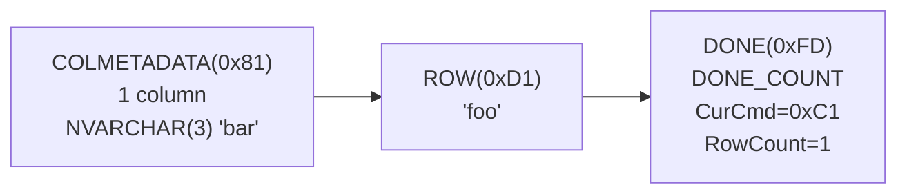

### COLMETADATA

```
81                ; Token type
01 00             ; Count = 1
; Column 1:
  00 00 00 00     ; UserType = 0
  20 00           ; Flags = 0x0020 (Nullable)
  A7              ; TypeId = NVARCHARTYPE (0xA7)
  03 00           ; MaxLength = 3 characters
  09 04 D0 00 34  ; Collation
  03              ; ColName length = 3 chars
  62 00 61 00 72 00  ; "bar" (UTF-16 LE)
```

### ROW

```
D1                ; Token type
  03 00           ; Data length = 3 chars (6 bytes)
  66 6F 6F        ; "foo" (raw bytes — note: this is the actual data)
```

### DONE

```
FD                ; Token type
10 00             ; Status = 0x0010 (DONE_COUNT)
C1 00             ; CurCmd = 0x00C1 (SELECT)
01 00 00 00 00 00 00 00  ; RowCount = 1
```

---

## 49. RPC Client Request (4.8)

Client → Server. Packet type 0x03. Named procedure "foo3" with one default-value parameter.

```
03 01 00 2F 00 00 01 00  ; Header: type=0x03, status=EOM, length=47
```

### ALL_HEADERS (same as SQL Batch)

```
16 00 00 00       ; TotalLength = 22
12 00 00 00       ; HeaderLength = 18
02 00             ; HeaderType = Transaction Descriptor
00 00 00 00 00 00 00 01  ; autocommit
00 00 00 00       ; OutstandingRequestCount = 0
```

### RPCReqBatch

```
; NameLenProcID:
  04 00           ; ProcName length = 4 chars
  66 00 6F 00 6F 00 33 00  ; "foo3" (UTF-16 LE)

; OptionFlags:
  00              ; fWithRecomp=0, fNoMetaData=0, fReuseMetaData=0

; ParameterData:
  00              ; ParamName length = 0 (unnamed)
  02              ; StatusFlags: fDefaultValue=1, fByRefValue=0
  26              ; TYPE_INFO: INTNTYPE (0x26)
  02              ; MaxLen = 2 bytes
  00              ; Data length = 0 (no value — uses default)
```

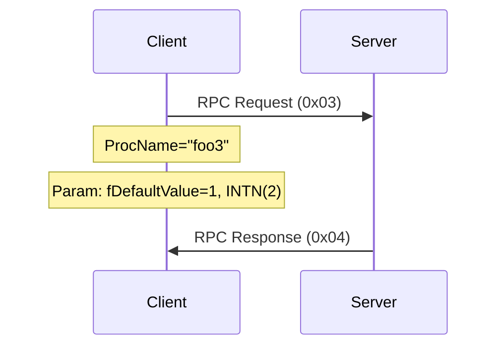

---

## 50. RPC Server Response (4.9)

Server → Client. Packet type 0x04. Response to RPC "foo3".

```
04 01 00 27 00 00 01 00  ; Header: type=0x04, status=EOM, length=39
```

### Token Stream

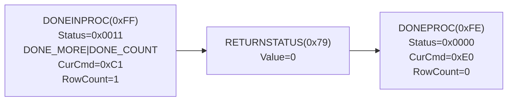

### DONEINPROC

```
FF                ; Token type
11 00             ; Status = 0x0011 (DONE_MORE | DONE_COUNT)
C1 00             ; CurCmd = 0x00C1 (SELECT)
01 00 00 00 00 00 00 00  ; RowCount = 1
```

### RETURNSTATUS

```
79                ; Token type
00 00 00 00       ; Value = 0 (success)
```

### DONEPROC

```
FE                ; Token type
00 00             ; Status = 0x0000 (DONE_FINAL)
E0 00             ; CurCmd = 0x00E0 (EXECUTE)
00 00 00 00 00 00 00 00  ; RowCount = 0
```

---

## 51. Attention Request (4.10)

Client → Server. Packet type 0x06. **Header only — no payload.**

```
06 01 00 08 00 00 01 00
```

| Field | Hex | Value |
|-------|-----|-------|
| Type | 06 | Attention |
| Status | 01 | EOM |
| Length | 00 08 | 8 (header only) |
| SPID | 00 00 | 0 |
| PacketID | 01 | 1 |
| Window | 00 | 0 |

Rules:
- Client must finish sending current packet (EOM) before sending Attention
- Server acknowledges with DONE(DONE_ATTN)
- Client discards all data until DONE with DONE_ATTN flag

---

## 52. SSPI Message (4.11)

Client → Server. Packet type 0x11. NTLMSSP authentication token.

```
11 01 00 5E 00 00 01 00  ; Header: type=0x11, status=EOM, length=94
```

### Payload

```
4E 54 4C 4D 53 53 50 00  ; "NTLMSSP\0" signature
03 00 00 00              ; MessageType = 3 (AUTHENTICATE)
00 00 58 00 ...          ; NTLM fields (LmResponse, NtResponse, etc.)
...
; Trailing NTLM auth data with workstation, domain info
15 C2 88 E2 06 00 71 17 00 00 0F 30 81
C1 7D 59 5F E9 3E 1A 7C 98 05 01 72 5C 4F
```

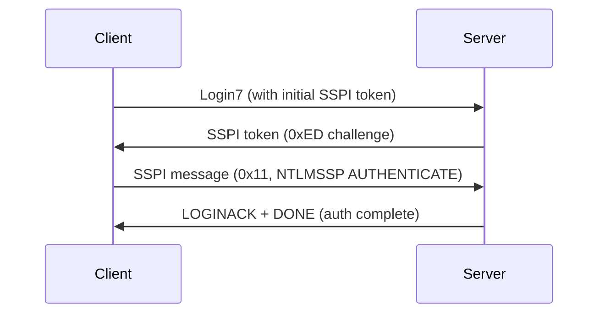

---

## 53. Bulk Load (4.12)

Client → Server. Packet type 0x07 (BulkLoadBCP). One INT column "c1" with a NULL row.

```
07 01 00 27 00 00 01 00  ; Header: type=0x07, status=EOM, length=39
```

### COLMETADATA

```
81                ; Token type
01 00             ; Count = 1
; Column 1:
  00 00 00 00     ; UserType = 0
  05 00           ; Flags = 0x0005 (Nullable | ReadOnly)
  26 04           ; TypeId = INTN (0x26), max length = 4 bytes
  02              ; ColName length = 2 chars
  63 00 31 00     ; "c1" (UTF-16 LE)
```

### ROW (NULL)

```
D1                ; ROW token
  00              ; INTN data: length=0 → NULL
```

### DONE

```
FD                ; Token type
00 00             ; Status = 0x0000 (DONE_FINAL)
00 00             ; CurCmd = 0x0000
00 00 00 00 00 00 00 00  ; RowCount = 0
```

Note: NBCROW (0xD2) MUST NOT be used in BulkLoadBCP streams.

---

## 54. Transaction Manager Request (4.13)

Client → Server. Packet type 0x0E. TM_PROMOTE_XACT.

```
0E 01 00 20 00 00 01 00  ; Header: type=0x0E, status=EOM, length=32
```

### ALL_HEADERS

```
16 00 00 00       ; TotalLength = 22
12 00 00 00       ; HeaderLength = 18
02 00             ; HeaderType = Transaction Descriptor
00 00 00 00 00 00 00 01  ; TransactionDescriptor (autocommit)
00 00 00 00       ; OutstandingRequestCount = 0
```

### Request

```
16 00             ; RequestType = 0x0016 = 22 → TM_PROMOTE_XACT (type 6)
                  ; (no payload for TM_PROMOTE_XACT)
```

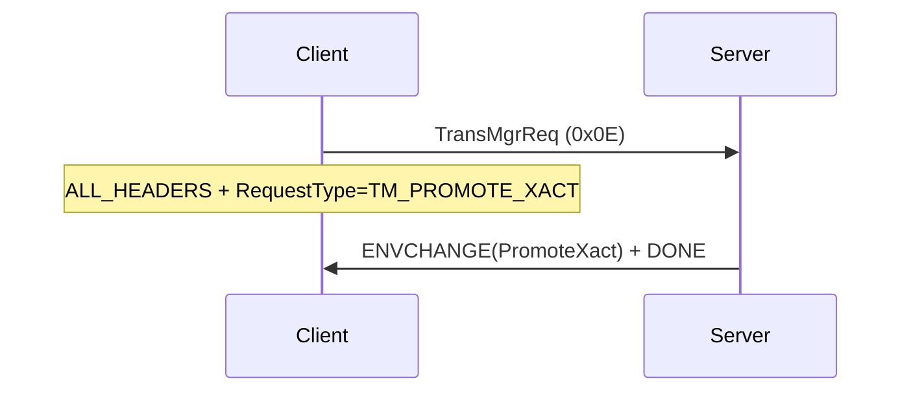

---

## 55. TVP Insert Statement (4.14)

Client → Server. Packet type 0x03 (RPC). Table-Valued Parameter with INTN column.

```
03 01 00 52 00 00 01 00  ; Header: type=0x03, status=EOM, length=82
```

### RPCReqBatch

```
; ProcName: "foo" (3 chars)
  03 00  66 00 6F 00 6F 00

; OptionFlags: 00

; ParameterData:
  00              ; ParamName length = 0
  00              ; StatusFlags = 0x00
```

### TVP TYPE_INFO

```
F3                ; TVPTYPE (0xF3)
; TVP_TYPENAME:
  00              ; DbName = "" (0 chars)
  03              ; OwningSchema = "dbo" (3 chars)
  64 00 62 00 6F 00
  07              ; TypeName = "tvptype" (7 chars)
  74 00 76 00 70 00 74 00 79 00 70 00 65 00

; TVP_COLMETADATA:
  01 00           ; Count = 1
  00 00 00 00     ; UserType = 0
  00 00           ; Flags = 0
  26              ; TypeId = INTNTYPE (0x26)
  01              ; MaxLen = 1 byte
  00              ; ColName = "" (0 chars)

; TVP_END_TOKEN (for COLMETADATA):
  00              ; End of column metadata

; TVP_ROW:
  01              ; TVP_ROW token
  01              ; Data length = 1 byte
  02              ; Value = 2

; TVP_END_TOKEN (for rows):
  00              ; End of TVP rows
```

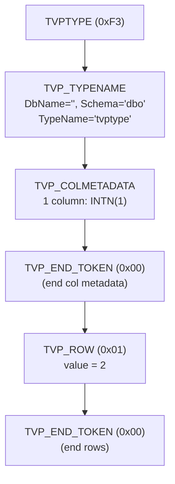

---

## 56. SparseColumn Select Statement (4.15)

Server → Client. Response with 2 columns: INTN "id" and XML "sparsePropertySet" (fSparseColumnSet=true).

```
04 01 01 B9 00 00 01 00  ; Header: type=0x04, status=EOM, length=441
```

### COLMETADATA

```
81                ; Token type
02 00             ; Count = 2

; Column 1: "id" — INTNTYPE
  00 00 00 00     ; UserType = 0
  09 00           ; Flags = 0x0009 (Nullable)
  26              ; TypeId = INTNTYPE (0x26)
  04              ; MaxLen = 4
  02              ; ColName = "id" (2 chars)
  69 00 64 00

; Column 2: "sparsePropertySet" — XMLTYPE
  00 00 00 00     ; UserType = 0
  0B 04           ; Flags = 0x040B (Nullable | fSparseColumnSet)
  F1              ; TypeId = XMLTYPE (0xF1)
  00              ; SCHEMA_PRESENT = false
  11              ; ColName = "sparsePropertySet" (17 chars)
  73 00 70 00 61 00 72 00 73 00 65 00 50 00 72 00
  6F 00 70 00 65 00 72 00 74 00 79 00 53 00 65 00 74 00
```

### Row Data: ROW + ROW + NBCROW*6

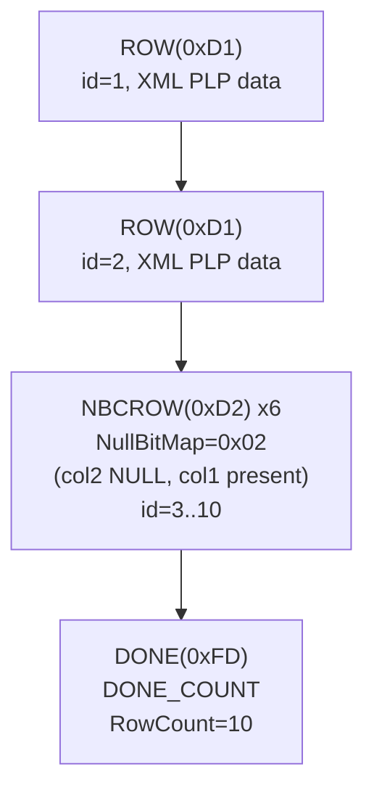

### NBCROW Format

```
D2                ; NBCROW token
02                ; NullBitMap: bit0=0 (id present), bit1=1 (XML NULL)
04                ; INTN data length = 4
04 00 00 00       ; id = 4
; (no XML data — indicated as NULL by bitmap)
```

---

## 57. FeatureExt with SESSIONRECOVERY (4.16)

Client → Server. Login7 with FeatureExt containing SESSIONRECOVERY data.

```
10 01 01 0D 00 00 01 00  ; Header: type=0x10, status=EOM, length=269
```

### FeatureExt

```
; FeatureOpt:
  01              ; FeatureId = SESSIONRECOVERY
  67 00 00 00     ; FeatureDataLen = 103

; FeatureData — InitSessionRecoveryData:
  56 00 00 00     ; Length = 86
  ; RecoveryDatabase:
    06             ; Length = 6 chars
    6D 00 61 00 73 00 74 00 65 00 72 00  ; "master"
  ; RecoveryCollation:
    05             ; Length = 5 bytes
    09 04 D0 00 34 ; Collation bytes
  ; RecoveryLanguage:
    0A             ; Length = 10 chars
    75 00 73 00 5F 00 65 00 6E 00 67 00 6C 00 69 00
    73 00 68 00    ; "us_english"

  ; SessionStateDataSet (8 entries):
    StateId=0x00, Len=9:  00 60 81 14 FF E7 FF FF 00
    StateId=0x02, Len=2:  07 01
    StateId=0x04, Len=1:  00
    StateId=0x05, Len=4:  FF FF FF FF
    StateId=0x06, Len=1:  00
    StateId=0x07, Len=1:  02
    StateId=0x08, Len=8:  00 00 00 00 00 00 00 00
    StateId=0x09, Len=4:  FF FF FF FF

; FeatureData — SessionRecoveryDataToBe:
  09 00 00 00     ; Length = 9
  ; RecoveryDatabase: "" (0 chars)
  ; RecoveryCollation: 0 bytes
  ; RecoveryLanguage: "" (0 chars)
  ; SessionStateDataSet (1 entry):
    StateId=0x09, Len=4:  28 23 00 00

TERMINATOR: FF
```

---

## 58. FeatureExtAck with SESSIONRECOVERY (4.17)

Server → Client. Login response with FEATUREEXTACK containing SESSIONRECOVERY SessionStateDataSet.

*(See section 45 for standard login response token pattern. This example extends it with FEATUREEXTACK containing session state.)*

---

## 59. Table Response with SESSIONSTATE (4.18)

Server → Client. Response containing SESSIONSTATE token (0xE4).

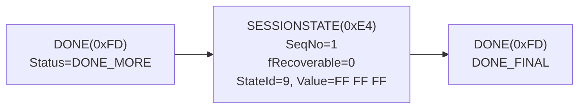

### SESSIONSTATE Token

```
E4                ; Token type (SESSIONSTATE)
XX XX XX XX       ; Length (DWORD)
01 00 00 00       ; SeqNo = 1
00                ; Status: fRecoverable = 0

; SessionStateData:
  09              ; StateId = 9
  04              ; StateLen = 4
  FF FF FF 00     ; StateValue
```

---

## 60. Token Stream Communication (4.19)

### Multi-Statement SQL Batch

```mermaid
sequenceDiagram
    participant C as Client
    participant S as Server

    C->>S: SQL Batch: "SELECT ...; UPDATE ...; SELECT ..."
    S->>C: COLMETADATA + ROW* + DONE(DONE_MORE|DONE_COUNT)
    S->>C: DONE(DONE_MORE|DONE_COUNT) [UPDATE result]
    S->>C: COLMETADATA + ROW* + DONE(DONE_FINAL|DONE_COUNT)
```

### Out-of-Band Attention

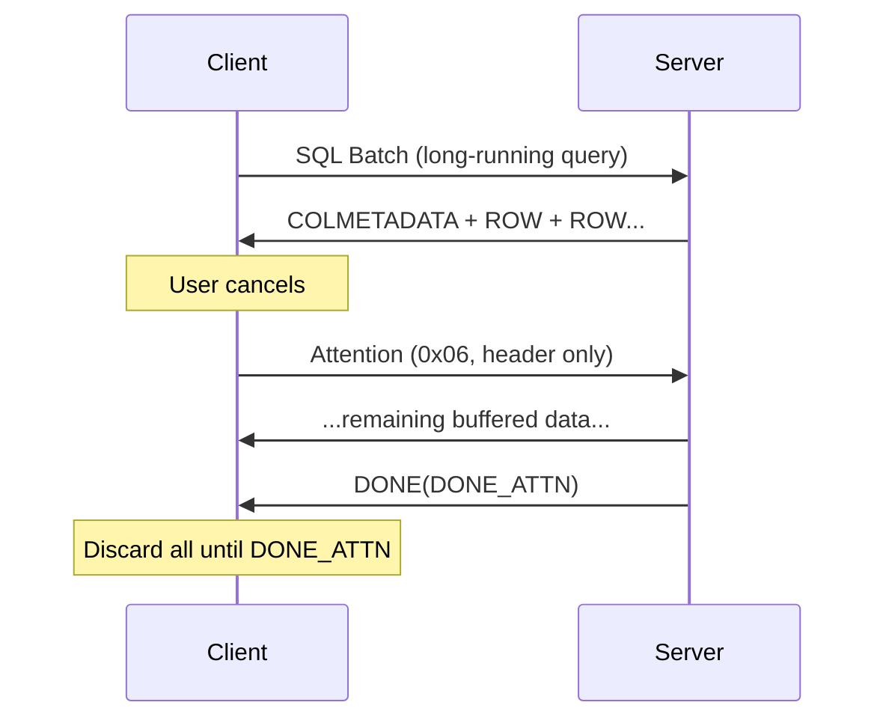

---

## 61. FeatureExt with AZURESQLSUPPORT (4.20)

Client → Server. Login7 with multiple FeatureExt options.

### FeatureExt Block

```
; FeatureOpt 1:
  01              ; FeatureId = SESSIONRECOVERY (0x01)
  ...             ; FeatureData

; FeatureOpt 2:
  04              ; FeatureId = COLUMNENCRYPTION (0x04)
  ...             ; FeatureData

; FeatureOpt 3:
  05              ; FeatureId = GLOBALTRANSACTIONS (0x05)
  ...             ; FeatureData

; FeatureOpt 4:
  08              ; FeatureId = AZURESQLSUPPORT (0x08)
  ...             ; FeatureData

; TERMINATOR:
  FF
```

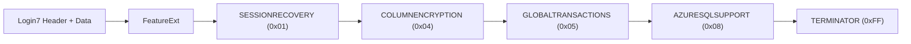

---

## 62. FeatureExtAck with AZURESQLSUPPORT (4.21)

Server → Client. Login response acknowledging multiple features.

### Token Stream

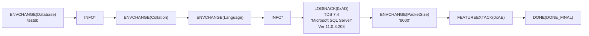

### FEATUREEXTACK

```
AE                ; Token type

; FeatureAckOpt 1:
  01              ; FeatureId = SESSIONRECOVERY
  XX XX XX XX     ; FeatureAckDataLen
  ...             ; SessionStateDataSet

; FeatureAckOpt 2:
  04              ; FeatureId = COLUMNENCRYPTION
  XX XX XX XX     ; FeatureAckDataLen
  ...

; FeatureAckOpt 3:
  05              ; FeatureId = GLOBALTRANSACTIONS
  XX XX XX XX     ; FeatureAckDataLen
  ...

; FeatureAckOpt 4:
  08              ; FeatureId = AZURESQLSUPPORT
  XX XX XX XX     ; FeatureAckDataLen
  ...

; TERMINATOR:
  FF
```

---

## 63. Version & Appendix Notes (Chapters 5-7)

### TDS Version ↔ SQL Server Mapping

| TDS Version | Client→Server Bytes | Server→Client Bytes | SQL Server |
|-------------|--------------------|--------------------|------------|
| TDS 7.0 | 00 00 00 70 | 70 00 00 00 | SQL Server 7.0 |
| TDS 7.1 | 00 00 00 71 | 71 00 00 00 | SQL Server 2000 |
| TDS 7.1 Rev 1 | 01 00 00 71 | 71 00 00 01 | SQL Server 2000 SP1 |
| TDS 7.2 | 02 00 09 72 | 72 09 00 02 | SQL Server 2005 |
| TDS 7.3.A | 03 00 0A 73 | 73 0A 00 03 | SQL Server 2008 |
| TDS 7.3.B | 03 00 0B 73 | 73 0B 00 03 | SQL Server 2008 R2 |
| TDS 7.4 | 04 00 00 74 | 74 00 00 04 | SQL Server 2012+ |

Note: Bytes are **reversed** between client→server and server→client formats.

### Security (Chapter 5)

- TLS/SSL for encryption (login-only or full)
- SSPI (NTLM/Kerberos) for Windows authentication
- Federated Authentication (ADAL/AKV) for Azure AD
- Data Classification tokens for sensitivity metadata
- Always Encrypted for column-level encryption

### Change Tracking (Chapter 7)

v20260223: Added **USERAGENT** to FeatureExt and FeatureExtAck.
