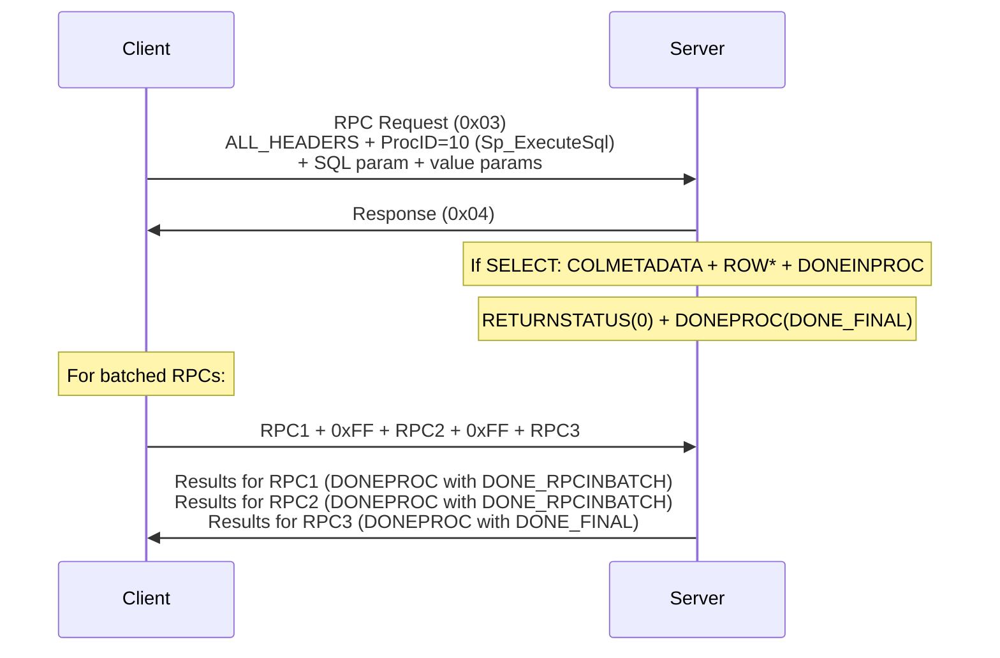
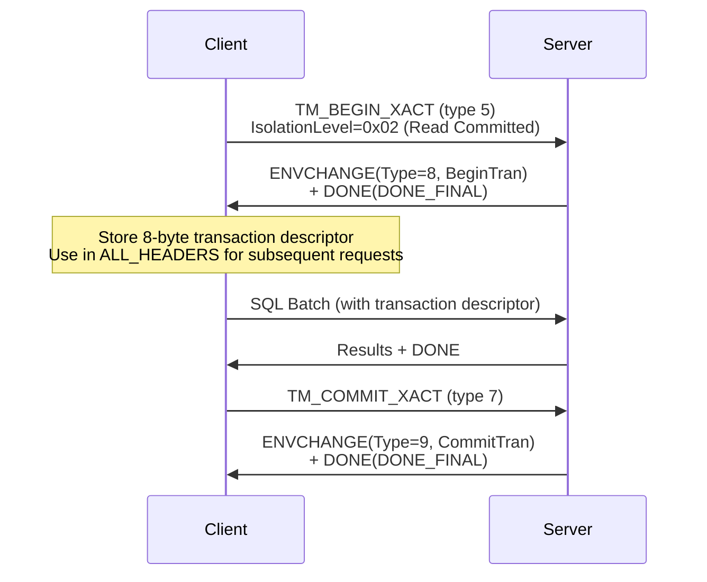
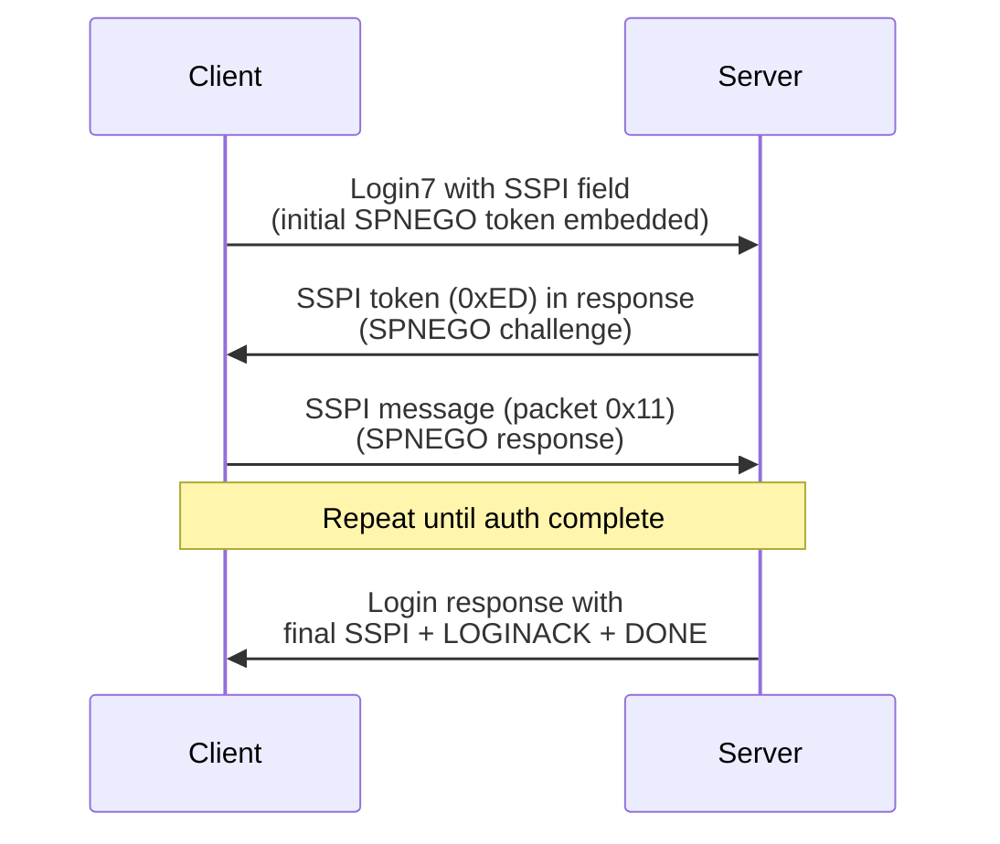
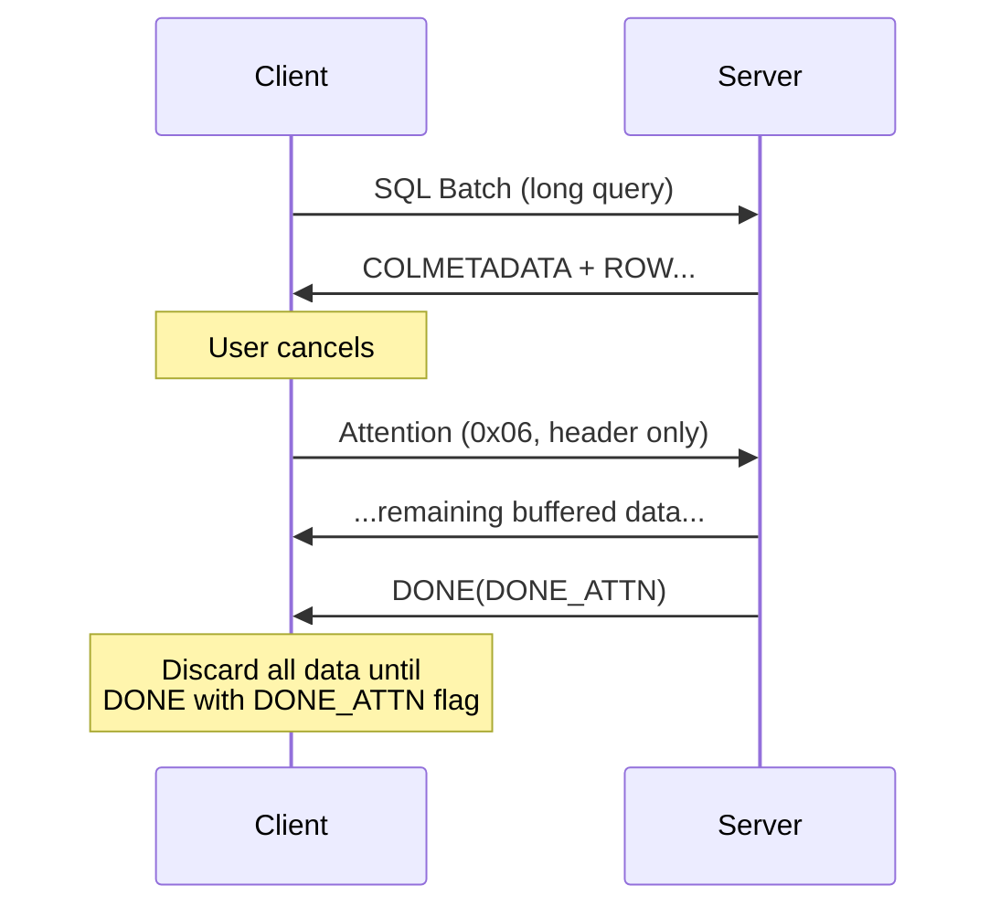

# TDS Messages

> Source: [MS-TDS] v20260223, Sections 2.2.6.6-2.2.6.9

## 15. ALL_HEADERS

Required for SQLBatch, RPCRequest, and TransactionManagerRequest in TDS 7.2+.

```
ALL_HEADERS = TotalLength(DWORD LE) 1*Header
Header      = HeaderLength(DWORD LE) HeaderType(USHORT LE) HeaderData
```

### Header Types

| Type | Name | Required? |
|------|------|-----------|
| 0x0001 | Query Notifications | Optional (not supported by SQL Server 7.0, 2000) |
| 0x0002 | Transaction Descriptor | **Required** in TDS 7.2+ |
| 0x0003 | Trace Activity | Optional (TDS 7.4) |

### Transaction Descriptor Header (Type 0x0002)

```
HeaderData = TransactionDescriptor(ULONGLONG 8B) + OutstandingRequestCount(DWORD 4B)
```

- HeaderLength = 18 (4 + 2 + 8 + 4)
- TotalLength = 22 (4 + 18) when only this header
- **AutoCommit mode**: TransactionDescriptor=0x0000000000000000, OutstandingRequestCount=1
- **In transaction**: TransactionDescriptor from ENVCHANGE type 8, OutstandingRequestCount=1 (or 0 for MARS)

### Query Notifications Header (Type 0x0001)

```
HeaderData = NotifyId(US_VARCHAR) SSBDeployment(US_VARCHAR) NotifyTimeout(ULONG)
```

### Trace Activity Header (Type 0x0003, TDS 7.4)

```
HeaderData = ActivityId(GUID 16B) + ActivitySequence(ULONG 4B)
```

---

## 16. SQL Batch Message

Packet type: **0x01**. Tokenless stream.

```
SQLBatch = ALL_HEADERS [*EnclavePackage] SQLText(UNICODESTREAM)

EnclavePackage = L_VARBYTE    ; TDS 7.4, for Always Encrypted secure enclaves
```

SQLText is the SQL statement(s) encoded in UTF-16 LE with **no length prefix** and **no null terminator**. Length is determined from the packet (total data length minus ALL_HEADERS size).

---

## 17. RPC Request Message

Packet type: **0x03**. Tokenless stream.

```
RPCRequest = ALL_HEADERS RPCReqBatch *((BatchFlag/NoExecFlag) RPCReqBatch) [BatchFlag/NoExecFlag]

RPCReqBatch = NameLenProcID OptionFlags [*EnclavePackage] *ParameterData

NameLenProcID = ProcName(US_VARCHAR)              ; named procedure
              / (0xFFFF ProcID(USHORT LE))         ; system proc by ID

ParameterData = ParamName(B_VARCHAR) StatusFlags(BYTE) TYPE_INFO TYPE_VARBYTE
                [ParamCipherInfo]                   ; TDS 7.4, when fEncrypted set
```

### Well-Known Stored Procedure IDs

| ID | Name | Common Use |
|----|------|-----------|
| 1 | Sp_Cursor | Cursor operations |
| 2 | Sp_CursorOpen | Open cursor |
| 3 | Sp_CursorPrepare | Prepare cursor |
| 4 | Sp_CursorExecute | Execute prepared cursor |
| 5 | Sp_CursorPrepExec | Prepare and execute cursor |
| 6 | Sp_CursorUnprepare | Unprepare cursor |
| 7 | Sp_CursorFetch | Fetch from cursor |
| 8 | Sp_CursorOption | Set cursor option |
| 9 | Sp_CursorClose | Close cursor |
| 10 | Sp_ExecuteSql | Execute parameterized SQL |
| 11 | Sp_Prepare | Prepare statement |
| 12 | Sp_Execute | Execute prepared statement |
| 13 | Sp_PrepExec | Prepare and execute |
| 14 | Sp_PrepExecRpc | Prepare and execute RPC |
| 15 | Sp_Unprepare | Unprepare statement |

### Parameter StatusFlags

| Bit | Name | Description |
|-----|------|-------------|
| 0 | fByRefValue | 1 = OUTPUT parameter |
| 1 | fDefaultValue | 1 = use default value |
| 3 | fEncrypted | 1 = encrypted (TDS 7.4) |

### OptionFlags

| Bit | Name | Description |
|-----|------|-------------|
| 0 | fWithRecomp | Execute with recompile |
| 1 | fNoMetaData | Suppress COLMETADATA in response |
| 2 | fReuseMetaData | Server may reuse cached metadata |

### BatchFlag / NoExecFlag

- `0x80` = BatchFlag (TDS 7.0-7.1)
- `0xFF` = BatchFlag (TDS 7.2+, separator between RPCs in a batch)
- `0xFE` = NoExecFlag (do not execute this RPC, TDS 7.2+)

### RPC Request/Response Flow



---

## 18. Transaction Manager Request

Packet type: **0x0E (14)**.

```
TransMgrReq = ALL_HEADERS RequestType(USHORT LE) [RequestPayload]
```

### Request Types

| Value | Name | Payload |
|-------|------|---------|
| 0 | TM_GET_DTC_ADDRESS | (empty) |
| 1 | TM_PROPAGATE_XACT | US_VARBYTE (DTC buffer) |
| 5 | TM_BEGIN_XACT | IsolationLevel(1B) + BeginXactName(B_VARBYTE) |
| 6 | TM_PROMOTE_XACT | (no payload) |
| 7 | TM_COMMIT_XACT | XactName(B_VARBYTE) + Flags(1B) + [IsolationLevel + BeginXactName] |
| 8 | TM_ROLLBACK_XACT | XactName(B_VARBYTE) + Flags(1B) + [IsolationLevel + BeginXactName] |
| 9 | TM_SAVE_XACT | XactSavepointName(B_VARBYTE) |

### Isolation Levels

| Value | Level |
|-------|-------|
| 0x00 | No change (use current) |
| 0x01 | Read Uncommitted |
| 0x02 | Read Committed |
| 0x03 | Repeatable Read |
| 0x04 | Serializable |
| 0x05 | Snapshot |

### Commit/Rollback Flags

Bit 0 (fBeginXact): If 1, start new transaction after commit/rollback. When 1, IsolationLevel and BeginXactName follow.

### Transaction Flow



---

## 19. Bulk Load Message

Packet type: **0x07**. Two sub-streams depending on context.

### BulkLoadBCP (INSERT BULK)

Client must first send `INSERT BULK tablename (cols) ...` as a SQL Batch (type 0x01), then follow with type 0x07:

```
BulkLoadBCP = COLMETADATA *ROW DONE
```

Structure is identical to a server SELECT result but sent **client → server**.

**Restrictions:**
- NBCROW (0xD2) MUST NOT be used in BulkLoadBCP streams
- XMLTYPE must be sent as NVARCHAR(N) or NVARCHAR(MAX)
- UDTTYPE not supported — use VARBINARYTYPE
- DECIMALTYPE/NUMERICTYPE not supported — use DECIMALNTYPE/NUMERICNTYPE

### BulkLoadUTWT (UPDATETEXT/WRITETEXT BULK)

```
BulkLoadUTWT = L_VARBYTE    ; 4-byte length + raw data
```

Used after `UPDATETEXT BULK` or `WRITETEXT BULK`. Server returns RETURNVALUE token with new timestamp.

---

## 20. Federated Auth Token Message

Packet type: **0x08**. Client → Server. Sent after receiving FEDAUTHINFO token.

```
FEDAUTH = DataLen(DWORD LE) FedAuthToken(L_VARBYTE) [Nonce(32 bytes)]
```

- DataLen = total length of stream
- FedAuthToken = 4-byte length prefix + token bytes
- Nonce only present when server sent NONCEOPT in PreLogin response
- Only used with bFedAuthLibrary = ADAL (0x02)

---

## 21. SSPI Message

Packet type: **0x11**. Client → Server. Used during SSPI/SPNEGO authentication.

```
SSPI = SSPIData(BYTESTREAM)
```

### SSPI Authentication Flow



Uses NTLM or Kerberos via SPNEGO [RFC4178].

---

## 22. Attention Signal

Packet type: **0x06**. No data payload (header only, Length = 8). Used to cancel in-progress requests.



Rules:
- Client must complete current packet (send EOM) before sending attention
- Server acknowledges with DONE token having DONE_ATTN flag (0x0020)
- Client must read and discard all server data until attention acknowledgement
- There might be a DONE with DONE_MORE clear prior to the DONE with DONE_ATTN
