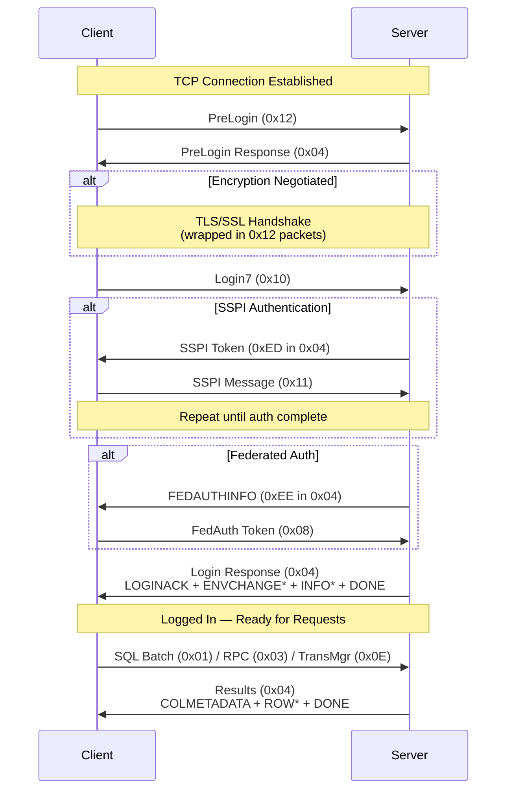
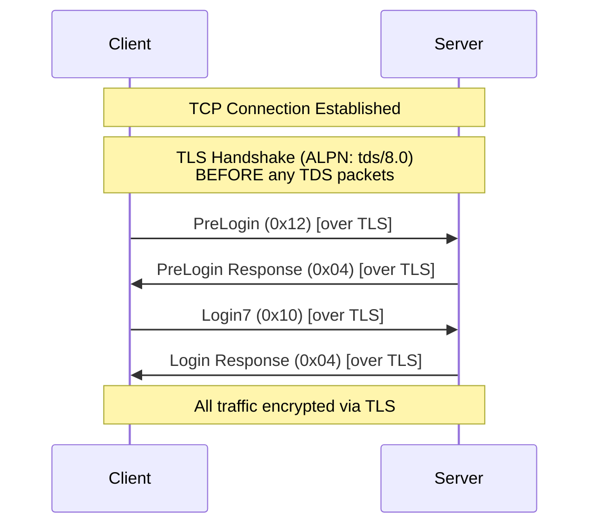
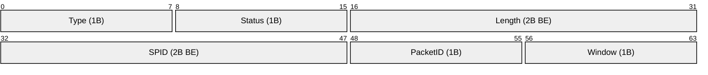
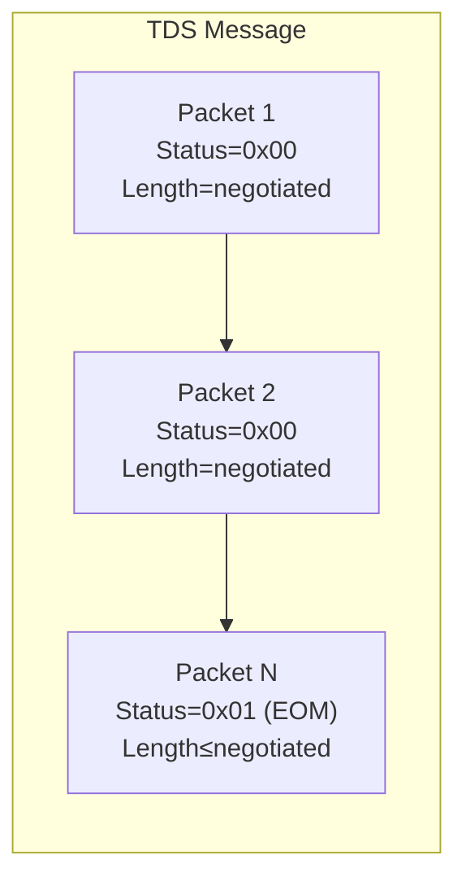

# TDS Packet Framing

> Source: [MS-TDS] v20260223, Sections 1, 2.2.3

## 1. Protocol Overview

TDS is a client-server protocol layered on top of TCP (or Named Pipes/VIA). All integers are **little-endian** unless noted otherwise. Character data is **UTF-16 LE** (UCS-2). The protocol operates in a half-duplex request-response model (except Attention).

### TDS Versions

| TDS Version | SQL Server | Client→Server hex | Server→Client hex (LOGINACK) |
|-------------|------------|-------------------|------------------------------|
| 7.0 | SQL Server 7.0 | `0x00000070` | `0x07000000` |
| 7.1 | SQL Server 2000 | `0x00000071` | `0x07010000` |
| 7.1 Rev 1 | SQL Server 2000 SP1 | `0x01000071` | `0x71000001` |
| 7.2 | SQL Server 2005 | `0x02000972` | `0x72090002` |
| 7.3.A | SQL Server 2008 | `0x03000A73` | `0x730A0003` |
| 7.3.B | SQL Server 2008 R2 | `0x03000B73` | `0x730B0003` |
| 7.4 | SQL Server 2012-2025 | `0x04000074` | `0x74000004` |
| 8.0 | SQL Server 2022-2025 | TLS-first, ALPN `tds/8.0` | same as 7.4 |

Note: SQL Server 2008 TDS 0x03000A73 does NOT include NBCROW/fSparseColumnSet support. TDS version bytes are reversed between client→server and server→client formats.

### Connection Flow (TDS 7.x)



### Connection Flow (TDS 8.0)



---

## 2. Packet Header (8 bytes)

```
Offset  Size  Field       Byte Order   Description
──────  ────  ──────────  ──────────   ─────────────────────────────────
0       1     Type        -            Packet type (see table below)
1       1     Status      -            Bit flags (see table below)
2       2     Length      BIG-ENDIAN   Total packet size INCLUDING header
4       2     SPID        BIG-ENDIAN   Server process ID (client sends 0x0000)
6       1     PacketID    -            Increments mod 256 per packet in message
7       1     Window      -            Always 0x00
```



### Packet Types

| Value | Name | Direction | Payload? |
|-------|------|-----------|----------|
| 0x01 | SQL Batch | C→S | Yes |
| 0x02 | Pre-TDS7 Login | C→S | Yes |
| 0x03 | RPC | C→S | Yes |
| 0x04 | Tabular Result | S→C | Yes |
| 0x05 | Attention Signal | C→S | Pre-SQL 7.0 only (out-of-band "A") |
| 0x06 | Attention | C→S | **No** (header only, Length=8) |
| 0x07 | Bulk Load | C→S | Yes |
| 0x08 | Federated Auth Token | C→S | Yes |
| 0x0E (14) | Transaction Manager Request | C→S | Yes |
| 0x10 (16) | TDS7 Login | C→S | Yes |
| 0x11 (17) | SSPI | C→S | Yes |
| 0x12 (18) | Pre-Login | C↔S | Yes |

### Status Flags

| Bit | Mask | Name | Description |
|-----|------|------|-------------|
| 0 | 0x01 | EOM | End of message — last packet of current message |
| 1 | 0x02 | Ignore | Ignore event (server→client; EOM must also be set) |
| 2 | 0x04 | RESETCONNECTION | Reset connection on next message (TDS 7.1+ MARS only) |
| 3 | 0x08 | RESETCONNECTIONSKIPTRAN | Reset but keep transaction state (TDS 7.3+ MARS only) |

### Packet Size

- Default: **4096 bytes** (including 8-byte header)
- Valid range: **512 to 32,767** bytes
- Must be ≤ 4096 until negotiated via Login7/ENVCHANGE
- Last packet (EOM=1) can be shorter than negotiated size
- Non-final packets MUST be exactly the negotiated size (TDS 7.3+)
- Data capacity per packet = negotiated_size − 8
- PacketID starting value: 0 (MDAC/SNAC) or 1 (.NET SqlClient) — both valid

---

## 3. Message Framing

A TDS **message** consists of one or more **packets**. Only the last packet has EOM set.



### Splitting Rules
- If message data exceeds (packet_size − 8), split across multiple packets
- Each packet gets its own 8-byte header with incrementing PacketID
- Non-final packets must be exactly the negotiated packet size

### Reassembly Rules
- Concatenate payload bytes (after 8-byte header) from all packets until EOM
- PacketID can wrap around (mod 256) for very large messages
- Length field includes the 8-byte header itself

---

## 4. Packet Data Streams

Two categories of data follow the packet header:

### Token Streams (packet type 0x04 — server responses)

Server responses contain a sequence of tokens. Each token starts with a 1-byte token ID.

Token classes (determined by bits 2-3 of token byte):
- **Zero-length** (01): just the type byte (TVP_ROW 0x01, TVP_END 0x00)
- **Fixed-length** (11): type + fixed data (RETURNSTATUS = type + 4B, DONE/DONEPROC/DONEINPROC = type + 12B)
- **Variable-length** (10): type + USHORT length + data (ERROR, INFO, ENVCHANGE, LOGINACK, etc.)
- **Variable-count** (00): type + count + repeated structures (COLMETADATA, ORDER, etc.)

### Tokenless Streams (client→server messages)

| Packet Type | Message | Structure |
|-------------|---------|-----------|
| 0x12 | PreLogin | Option headers + option data |
| 0x10 | Login7 | Fixed header + offset/length pairs + variable data + FeatureExt |
| 0x01 | SQL Batch | ALL_HEADERS + SQL text (UTF-16 LE, no length prefix) |
| 0x03 | RPC Request | ALL_HEADERS + proc name/ID + parameters |
| 0x07 | Bulk Load (BCP) | COLMETADATA + ROW* + DONE |
| 0x07 | Bulk Load (UTWT) | L_VARBYTE (4B length + raw data) |
| 0x0E | Transaction Manager | ALL_HEADERS + request type + payload |
| 0x08 | Federated Auth | DataLen + FedAuthToken + [Nonce] |
| 0x11 | SSPI | Raw SPNEGO/NTLM/Kerberos bytes |
| 0x06 | Attention | No payload (header only) |
