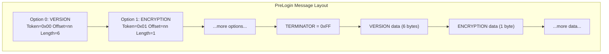
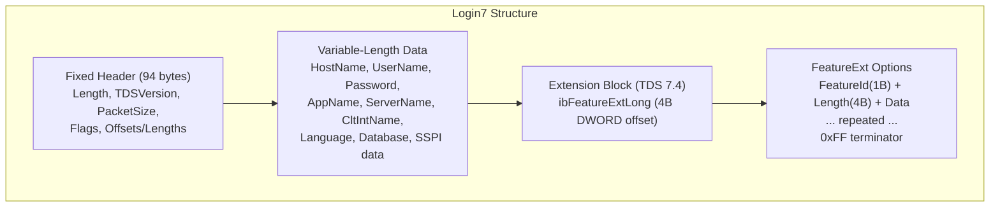
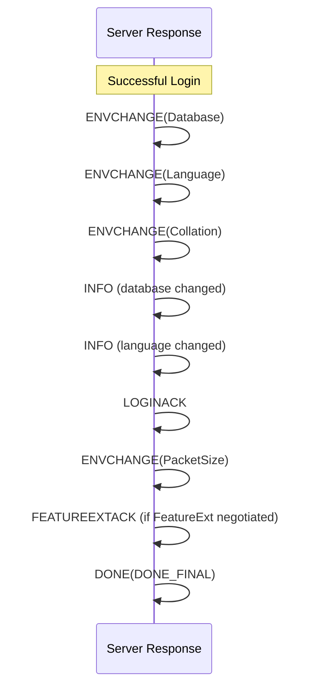

# TDS PreLogin & Login7

> Source: [MS-TDS] v20260223, Sections 2.2.6.4, 2.2.6.5

## 3. PreLogin Message

Packet type: **0x12**. Tokenless stream. Sent by client before login. Server responds with PreLogin response (packet type 0x04 wrapping 0x12 format).

### Structure

Option headers (5 bytes each) come first, terminated by 0xFF. Option data follows at specified offsets (relative to start of message, NOT packet).

```
PRELOGIN_OPTION = Token(1 byte) Offset(2 bytes, BIG-ENDIAN) Length(2 bytes, BIG-ENDIAN)
TERMINATOR      = 0xFF (1 byte, no offset/length)
```



### Option Tokens

| Token | Name | Data Length | Description |
|-------|------|------------|-------------|
| 0x00 | VERSION | 6 bytes | `UL_VERSION(4B) + US_SUBBUILD(2B)`. **Required, must be first.** |
| 0x01 | ENCRYPTION | 1 byte | Encryption negotiation |
| 0x02 | INSTOPT | variable | Instance name (null-terminated ASCII). Client: target instance; Server: actual instance. |
| 0x03 | THREADID | 4 bytes | Client thread ID (0x00000000 if not set) |
| 0x04 | MARS | 1 byte | MARS support: 0x00=Off, 0x01=On |
| 0x05 | TRACEID | 36 bytes | ClientTraceID(16B GUID) + ActivityID(16B GUID) + ActivitySequence(4B) |
| 0x06 | FEDAUTHREQUIRED | 1 byte | Client: 0x01=supports FedAuth; Server: 0x01=requires FedAuth |
| 0x07 | NONCEOPT | 32 bytes | Cryptographic nonce for encryption |
| 0xFF | TERMINATOR | 0 | End of option list |

Server MUST reject PreLogin if VERSION is not the first option token.

### Encryption Values

| Value | Name | Description |
|-------|------|-------------|
| 0x00 | ENCRYPT_OFF | Encryption available but off |
| 0x01 | ENCRYPT_ON | Encryption available and on |
| 0x02 | ENCRYPT_NOT_SUP | Encryption not available |
| 0x03 | ENCRYPT_REQ | Encryption required |

Additional flag (OR'd with above, TDS 7.4):
| 0x80 | ENCRYPT_CLIENT_CERT | Request certificate-based mutual TLS |
| 0x40 | ENCRYPT_EXT | Extended encryption (Azure, not supported by SQL Server) |

### Encryption Negotiation Matrix

| Client \ Server | OFF | ON | NOT_SUP | REQ |
|-----------------|-----|----|---------|-----|
| **OFF** | Login only | Full | None | **Error** |
| **ON** | Full | Full | **Error** | Full |
| **NOT_SUP** | None | **Error** | None | **Error** |
| **REQ** | Full | Full | **Error** | Full |

- **Login only** = encrypt first Login7 TDS packet via TLS, then cleartext
- **Full** = all traffic encrypted via TLS from handshake onward
- **None** = no encryption at all
- **Error** = connection fails

### TLS Handshake Wrapping (TDS 7.x)

When encryption is negotiated, TLS handshake messages are wrapped in TDS packets with type **0x12** (PreLogin). After handshake completes:
- **Login-only**: Only the first TDS packet of Login7 is encrypted; all subsequent packets are plaintext
- **Full encryption**: All TDS packets from handshake completion onward are encrypted

### TDS 8.0 Encryption

- TLS handshake occurs **before** any TDS packets (standard TLS with ALPN `tds/8.0`)
- PreLogin is sent **after** TLS is established
- All traffic is encrypted; encryption value in PreLogin is ignored
- Supports TLS 1.3

---

## 4. Login7 Message

Packet type: **0x10**. Tokenless stream.

### Fixed Portion (94 bytes)

```
Offset  Size  Field
0       4     Length          Total LOGIN7 length (DWORD LE)
4       4     TDSVersion      Client TDS version (DWORD LE)
8       4     PacketSize      Requested packet size (DWORD LE)
12      4     ClientProgVer   Client program version (DWORD LE)
16      4     ClientPID       Client process ID (DWORD LE)
20      4     ConnectionID    Connection ID (DWORD LE)
24      1     OptionFlags1    See below
25      1     OptionFlags2    See below
26      1     TypeFlags       See below
27      1     OptionFlags3    See below (TDS 7.2+) / Reserved
28      4     ClientTimeZone  Timezone offset in minutes (LONG LE, signed)
32      4     ClientLCID      Client locale ID (DWORD LE)
```

### Offset/Length Block (bytes 36-93)

All offsets (ib*) are USHORT from start of LOGIN7. All character counts (cch*) are USHORT in characters (not bytes). All strings are UTF-16 LE.

```
Offset  Size  Field
36      2+2   ibHostName + cchHostName
40      2+2   ibUserName + cchUserName
44      2+2   ibPassword + cchPassword
48      2+2   ibAppName + cchAppName
52      2+2   ibServerName + cchServerName
56      2+2   ibExtension + cbExtension (TDS 7.4) / ibUnused + cbUnused
60      2+2   ibCltIntName + cchCltIntName
64      2+2   ibLanguage + cchLanguage
68      2+2   ibDatabase + cchDatabase
72      6     ClientID (MAC address, 6 bytes)
78      2+2   ibSSPI + cbSSPI (byte count, not char count)
82      2+2   ibAtchDBFile + cchAtchDBFile
86      2+2   ibChangePassword + cchChangePassword (TDS 7.2+)
90      4     cbSSPILong (DWORD, TDS 7.2+; used if cbSSPI=0xFFFF)
```

Total fixed portion: **94 bytes** (offsets 0-93).

### Login7 Message Layout



### OptionFlags1 (byte 24, LSB order)

| Bit | Name | Values |
|-----|------|--------|
| 0 | fByteOrder | 0=x86 (LE), 1=68000 (BE). SQL Server ignores; assumes LE. |
| 1 | fChar | 0=ASCII, 1=EBCDIC. SQL Server ignores; assumes Unicode. |
| 2-3 | fFloat | 0=IEEE_754, 1=VAX, 2=ND5000. SQL Server assumes IEEE_754. |
| 4 | fDumpLoad | 0=ON, 1=OFF. Backup/restore notifications. |
| 5 | fUseDB | 0=OFF, 1=ON. USE DB notification. |
| 6 | fDatabase | 0=WARN, 1=FATAL. If initial DB fails. |
| 7 | fSetLang | 0=OFF, 1=ON. SET LANGUAGE notification. |

### OptionFlags2 (byte 25, LSB order)

| Bit | Name | Values |
|-----|------|--------|
| 0 | fLanguage | 0=WARN, 1=FATAL if initial language fails |
| 1 | fODBC | 0=OFF, 1=ON. Set ODBC on/off. |
| 2 | fTranBoundary | Removed in TDS 7.2 |
| 3 | fCacheConnect | Removed in TDS 7.2 |
| 4-6 | fUserType | 0=NORMAL, 1=SERVER, 2=REMUSER, 3=SQLREPL |
| 7 | fIntSecurity | 0=OFF, 1=ON (SSPI/integrated auth) |

### TypeFlags (byte 26, LSB order)

| Bit | Name | Values |
|-----|------|--------|
| 0-3 | fSQLType | 0=DFLT, 1=TSQL |
| 4 | fOLEDB | 0=OFF, 1=ON |
| 5 | fReadOnlyIntent | 0=OFF, 1=ON (ApplicationIntent=ReadOnly) |
| 6-7 | Reserved | |

### OptionFlags3 (byte 27, LSB order, TDS 7.2+)

| Bit | Name | Values |
|-----|------|--------|
| 0 | fChangePassword | 1=Change password request |
| 1 | fSendYukonBinaryXML | 1=Client supports binary XML |
| 2 | fUserInstance | 1=Request user instance |
| 3 | fUnknownCollationHandling | 1=Handle unknown collations (TDS 7.3) |
| 4 | fExtension | 1=Has FeatureExt block (TDS 7.4) |
| 5-7 | Reserved | |

### Password Scrambling

Applied per-byte on UTF-16 LE encoded password bytes:

```
Scramble:   scrambled = ((byte << 4) & 0xFF | (byte >> 4)) ^ 0xA5
Descramble: original  = ((byte ^ 0xA5) >> 4) | (((byte ^ 0xA5) << 4) & 0xFF)
```

### Login7 Field Length Constraints

| Field | Max Characters |
|-------|---------------|
| cchHostName | 128 |
| cchUserName | 128 |
| cchPassword | 128 |
| cchAppName | 128 |
| cchServerName | 128 |
| cbExtension | 255 bytes |
| cchCltIntName | 128 |
| cchLanguage | 128 |
| cchDatabase | 128 |
| cchAtchDBFile | 260 |
| cchChangePassword | 128 |

ibHostName MUST always point to start of variable-length data area even if length is 0.

---

## 5. FeatureExt (TDS 7.4, when fExtension=1)

Located at offset `ibExtension` in the variable data area. The first 4 bytes at that offset are `ibFeatureExtLong` (DWORD LE), a byte offset from the start of Login7 to the feature list.

### Feature List Format

```
FeatureExt = *FeatureOpt TERMINATOR(0xFF)
FeatureOpt = FeatureId(BYTE) FeatureDataLen(DWORD LE) FeatureData(FeatureDataLen bytes)
```

### Feature Extension IDs

| FeatureId | Name | FeatureData Description |
|-----------|------|------------------------|
| 0x01 | SESSIONRECOVERY | InitialSessionRecoveryData + SessionRecoveryDataToBe |
| 0x02 | FEDAUTH | FedAuth library(1B) + token(variable) + nonce(32B optional) |
| 0x04 | COLUMNENCRYPTION | Version(1B) + [EnclaveType(B_VARBYTE)] |
| 0x05 | GLOBALTRANSACTIONS | (empty, length=0) |
| 0x07 | AZURESQLDNSCACHING | (empty, length=0) |
| 0x08 | AZURESQLSUPPORT | AzureSqlSupportData (variable) |
| 0x09 | DATACLASSIFICATION | Version(1B) |
| 0x0A | UTF8SUPPORT | (empty, length=0) |
| 0x0B | AZURESQLDNSCACHING | (empty, length=0) |
| 0x0C | JSONSUPPORT | (empty, length=0) |
| 0x0D | VECTORSUPPORT | (empty, length=0) |
| 0x0E | ENHANCEDROUTINGSUPPORT | (empty, length=0) |
| 0x0F | USERAGENT | UserAgentString (UTF-8 bytes) |
| 0x10 | USERAGENT | (same, ID may vary per spec revision) |
| 0xFF | TERMINATOR | End of feature list |

### Federated Authentication Libraries

| Value | Library |
|-------|---------|
| 0x00 | Live ID Compact Token |
| 0x01 | FedAuth Token (STS URL from FEDAUTHINFO) |
| 0x02 | ADAL (Azure AD Authentication Library) |
| 0x03 | Security Token |

### SESSIONRECOVERY FeatureData Layout

```
InitSessionRecoveryData:
  Length(DWORD)
  RecoveryDatabase(B_VARCHAR)
  RecoveryCollation(B_VARBYTE)
  RecoveryLanguage(B_VARCHAR)
  SessionStateDataSet:
    *( StateId(BYTE) StateLen StateValue )

SessionRecoveryDataToBe:
  Length(DWORD)
  RecoveryDatabase(B_VARCHAR)
  RecoveryCollation(B_VARBYTE)
  RecoveryLanguage(B_VARCHAR)
  SessionStateDataSet
```

---

## 6. Login Response

Server responds with packet type **0x04** containing token stream:



### Failed Login Response

```
ERROR + DONE(DONE_ERROR | DONE_FINAL)
```

Server may also send DONE followed by closing the connection for fatal auth failures.
