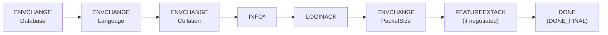
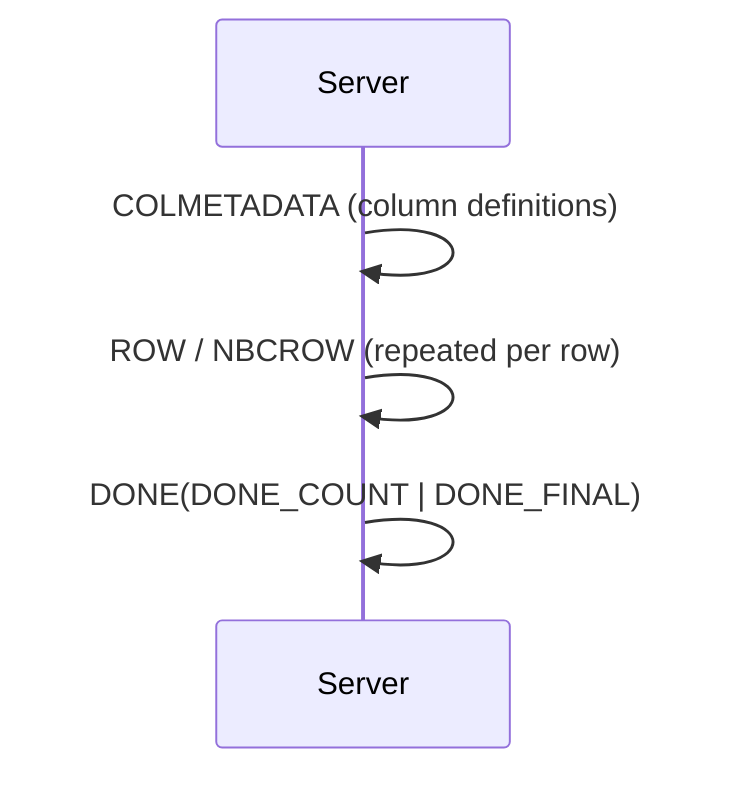
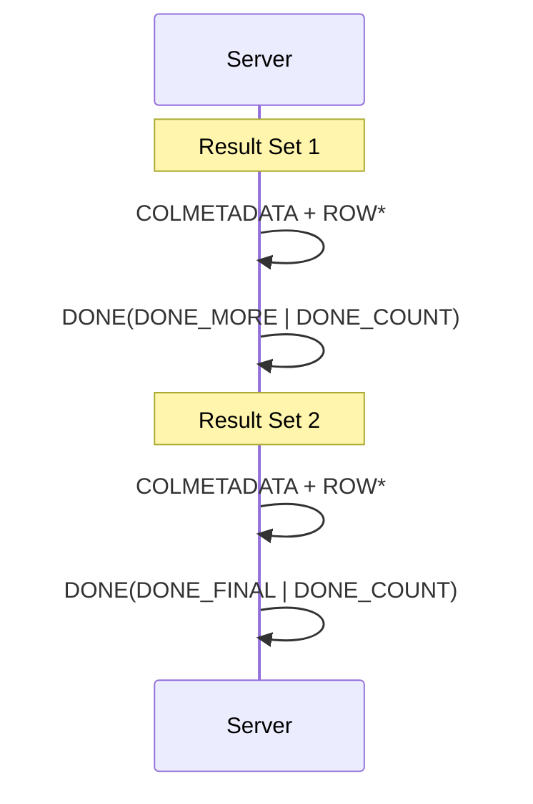
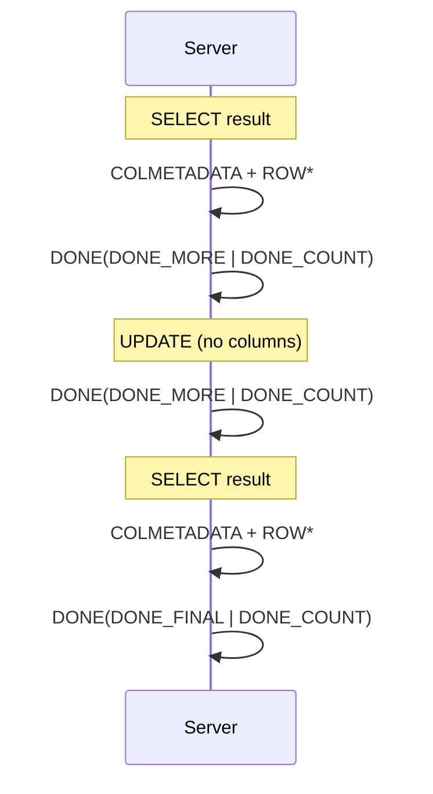
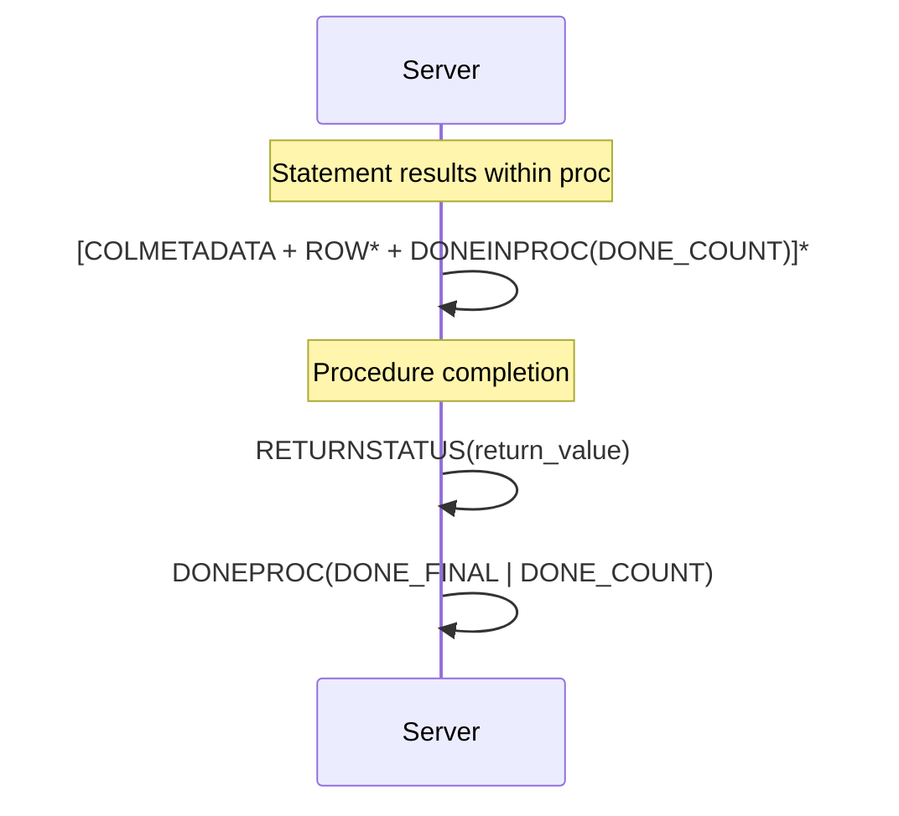
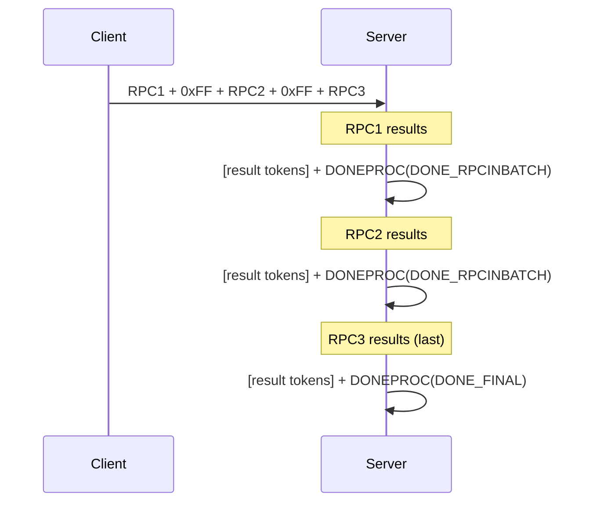
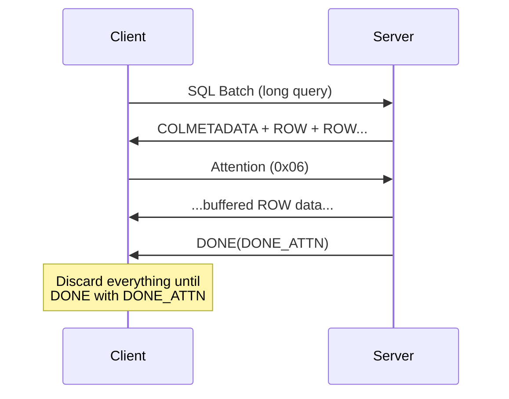

# TDS Server Response Patterns

> Source: [MS-TDS] v20260223, Sections 2.2.4, 3.x, 4.x

## 24. Server Response Patterns

### Successful Login Response



```
ENVCHANGE(Database) + ENVCHANGE(Language) + ENVCHANGE(Collation) +
[INFO tokens] + LOGINACK + ENVCHANGE(PacketSize) +
[FEATUREEXTACK] + DONE(DONE_FINAL)
```

### Failed Login Response

```
ERROR + DONE(DONE_ERROR | DONE_FINAL)
```

Server may close the connection immediately after sending error for fatal auth failures.

### Query with Result Set



```
COLMETADATA + (ROW|NBCROW)* + DONE(DONE_COUNT | DONE_FINAL)
```

### Multiple Result Sets



### Multi-Statement Batch (SELECT + UPDATE + SELECT)



Note: UPDATE/INSERT/DELETE produce DONE tokens (no COLMETADATA) with DONE_COUNT = affected rows.

### Stored Procedure Execution



```
[COLMETADATA + ROW* + DONEINPROC(DONE_COUNT)]* +
RETURNSTATUS + DONEPROC(DONE_FINAL | DONE_COUNT)
```

### Stored Procedure with OUTPUT Parameters

```
[COLMETADATA + ROW* + DONEINPROC]* +
RETURNVALUE* +
RETURNSTATUS +
DONEPROC(DONE_FINAL)
```

### Batched RPC Execution



### Error Response

```
ERROR + DONE(DONE_ERROR | DONE_FINAL)
```

### Error Within Statement Batch

```
[results for successful statements] +
ERROR + DONE(DONE_ERROR | DONE_MORE) +
[remaining statement results] +
DONE(DONE_FINAL)
```

### Transaction Begin (via TM_BEGIN_XACT)

```
ENVCHANGE(Type=8, BeginTran) + DONE(DONE_FINAL)
```

### Transaction Commit

```
ENVCHANGE(Type=9, CommitTran) + DONE(DONE_FINAL)
```

### Transaction Rollback

```
ENVCHANGE(Type=10, RollbackTran) + DONE(DONE_FINAL)
```

### Attention Acknowledgement



### Table Response with SESSIONSTATE

```
DONE(DONE_MORE) +
SESSIONSTATE(SeqNo, fRecoverable, StateData*) +
DONE(DONE_FINAL)
```

---

## 25. Variable-Length Data Stream Definitions

```
B_VARCHAR     = BYTELEN(1B) + *CHAR         ; length in CHARACTERS, data in UTF-16 LE
US_VARCHAR    = USHORTLEN(2B LE) + *CHAR    ; length in CHARACTERS, data in UTF-16 LE
B_VARBYTE     = BYTELEN(1B) + *BYTE         ; length in BYTES
US_VARBYTE    = USHORTLEN(2B LE) + *BYTE    ; length in BYTES
L_VARBYTE     = LONGLEN(4B LE) + *BYTE      ; length in BYTES
```

Important: B_VARCHAR and US_VARCHAR lengths are in **characters**. Multiply by 2 for byte count with UTF-16 LE encoding.
