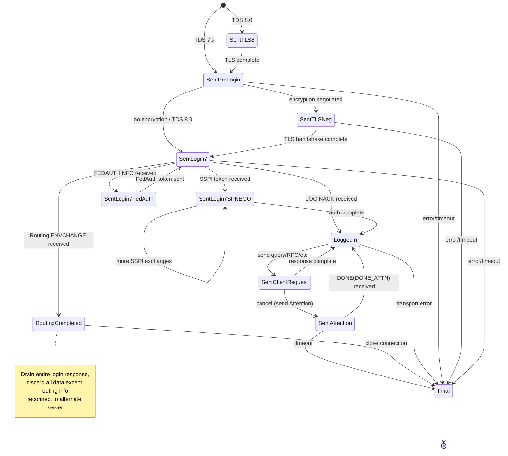
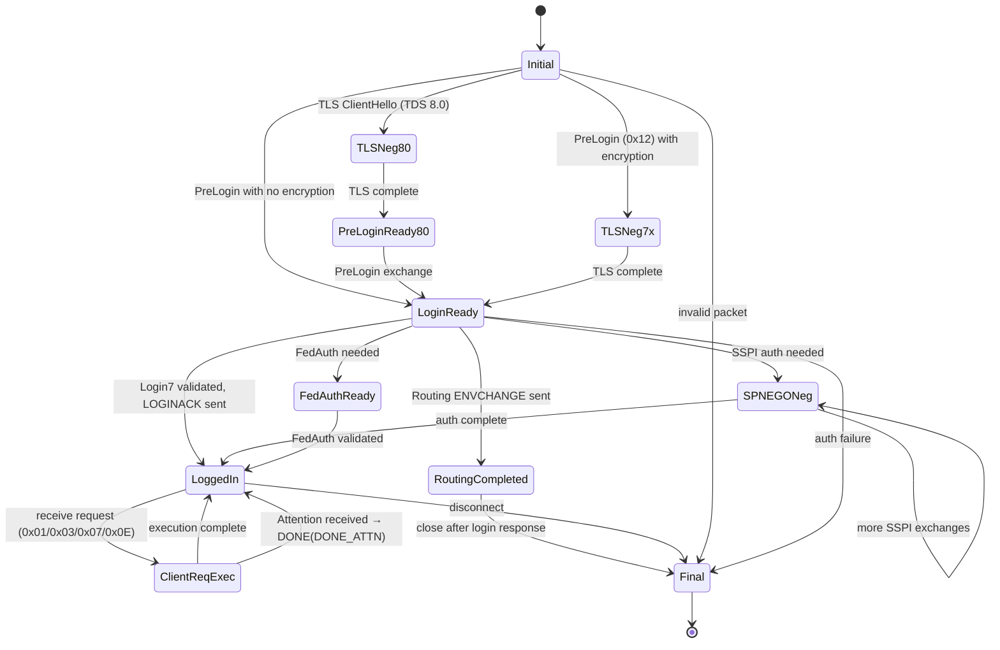
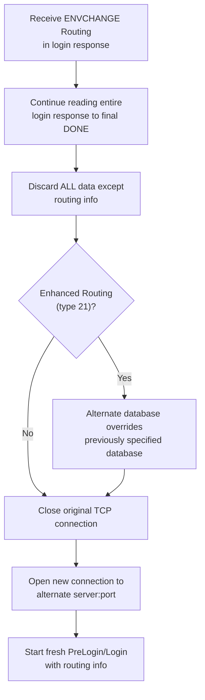
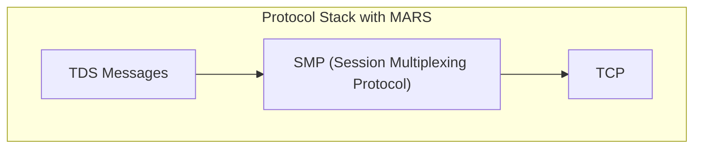

# TDS State Machines & Implementation Notes

> Source: [MS-TDS] v20260223, Sections 3.2, 3.3, 2.1

## 36. Key Implementation Notes

### Byte Order
- **All integers**: little-endian (LE) unless noted
- **Packet header Length and SPID**: big-endian (BE)
- **PreLogin option offsets and lengths**: big-endian (BE)
- **Money type (8B)**: high 4 bytes first, then low 4 bytes (not simple LE)
- **GUID**: mixed-endian (first 3 groups LE, last 2 groups BE)
- **TDS version in LOGINACK**: byte-reversed vs client→server format

### Null Representations by Type Category
| Category | NULL marker |
|----------|------------|
| Fixed-length types | Not nullable (use INTNTYPE etc. for nullable) |
| BYTELEN types | Length = 0x00 |
| USHORTLEN types | Length = 0xFFFF |
| LONGLEN types | Length = 0xFFFFFFFF |
| PLP types | 0xFFFFFFFFFFFFFFFF (8 bytes) |

### Common Pitfalls
1. COLMETADATA UserType is **4 bytes** in TDS 7.2+ (not 2)
2. DONE row count is **8 bytes** in TDS 7.2+ (not 4)
3. ERROR/INFO LineNumber is **4 bytes** in TDS 7.2+ (not 2)
4. Money (8B) byte order is NOT simple little-endian
5. Login7 password must be scrambled before sending
6. ALL_HEADERS is required for SQLBatch/RPC/TransMgr in TDS 7.2+
7. NBCROW (0xD2) uses null bitmap instead of per-column null markers
8. B_VARCHAR length is in **characters** (multiply by 2 for byte count with UTF-16)
9. US_VARCHAR length is in **characters** (multiply by 2 for byte count with UTF-16)
10. TDS version bytes are reversed between client→server and server→client formats
11. RETURNVALUE token has **no Length prefix** (unlike LOGINACK)
12. text/ntext/image in ROW: TextPointer+Timestamp precede data only when NOT NULL
13. DONE_INXACT (0x0004) is **NOT set by SQL Server** — reserved for future use
14. ALTMETADATA/ALTROW removed in SQL Server 2012+
15. PacketID start: MDAC/SNAC starts from 0, .NET SqlClient starts from 1 (both valid)
16. Error numbers < 20001 are reserved by SQL Server
17. SQL Server converts severity 10 to severity 0 before returning to application
18. DoneRowCount: LONG (4B) in TDS 7.0/7.1, ULONGLONG (8B) in TDS 7.2+
19. NULLTYPE (0x1F) can be sent to server in RPCRequest but SQL Server never emits it
20. PreLogin VERSION must be the first option token — server MUST reject otherwise

---

## 37. Client State Machine



### Client States

1. **Sent Initial TLS Negotiation Packet** (TDS 8.0 only) — standard TLS handshake; on completion send PRELOGIN
2. **Sent Initial PRELOGIN Packet** — handle encryption negotiation; enter TLS/SSL Negotiation or send Login7 directly
3. **Sent TLS/SSL Negotiation Packet** (TDS 7.x only) — exchange TLS packets (wrapped in 0x12) until handshake completes; then send Login7
4. **Sent LOGIN7 with Complete Auth Token** — on LOGINACK: if routing ENVCHANGE received → Routing Completed; otherwise → Logged In
5. **Sent LOGIN7 with SPNEGO Packet** — on SSPI token response: send SSPI message (type 0x11), re-enter this state
6. **Sent LOGIN7 with Federated Auth Request** — on FEDAUTHINFO token: generate FedAuth message, re-enter state 4
7. **Logged In** — on query: enter Sent Client Request; on transport error: Final State
8. **Sent Client Request** — on valid response: Logged In; on cancel: send Attention, enter Sent Attention
9. **Sent Attention** — discard data until DONE(DONE_ATTN) received; then → Logged In; on timeout → Final State
10. **Routing Completed** — drain entire login response; discard all data except routing info; close connection → Final State; reconnect to alternate server
11. **Final State** — connection disconnected; all resources recycled

### Cross-Cutting Rules
- On structurally invalid TDS message: close transport, enter Final State
- On transport error (TCP reset, keep-alive failure): close transport, stop all timers, enter Final State
- On entering Logged In or Final State: stop all timers

### Client Timers

| Timer | Default | Behavior on Timeout |
|-------|---------|---------------------|
| Connection | 15s (SqlClient: 30s) | Close connection, enter Final State |
| Client Request | Implementation-dependent (SqlClient: 30s, MDAC/SNAC: 0=infinite) | Send Attention, enter Sent Attention |
| Cancel | 5s (SqlClient) / 120s (MDAC/SNAC) | Close connection, enter Final State |

TCP Keep-Alive: 30s inactivity before first probe, 1s between retries.

---

## 38. Server State Machine



### Server States

1. **Initial** — on first packet: 0x12 (PreLogin) → respond, enter Login Ready; 0x16 (TLS ClientHello, TDS 8.0) → enter TLS Negotiation
2. **TLS/SSL Negotiation** (TDS 7.x) — exchange TLS packets (type 0x12) until completion → Login Ready
3. **TLS Negotiation** (TDS 8.0) — standard TLS handshake → PRELOGIN Ready
4. **PRELOGIN Ready** (TDS 8.0) — receive/respond to PRELOGIN → Login Ready
5. **Login Ready** — receive Login7; validate; on standard login: send LOGINACK → Logged In or Routing Completed; on SSPI: enter SPNEGO Negotiation
6. **SPNEGO Negotiation** — exchange SSPI tokens until authentication completes
7. **Federated Auth Ready** — receive FedAuth message, validate
8. **Logged In** — receive client requests (packet types 0x01, 0x03, 0x07, 0x0E) and execute them
9. **Client Request Execution** — executing query; on Attention: acknowledge with DONE(DONE_ATTN), return to Logged In
10. **Routing Completed** — routing ENVCHANGE sent; close connection after login response
11. **Final** — terminate

Server MUST reject PreLogin if VERSION is not the first option token. Upper layer can terminate connection at any time with no response sent.

---

## 39. TLS/SSL Encryption Rules

### Login-Only Encryption (TDS 7.x)
- Only the **first TDS packet** of the Login7 message is encrypted via TLS/SSL
- All subsequent packets are plaintext

### Full Encryption (TDS 7.x)
- All TDS packets from TLS handshake completion onward are encrypted

### TDS 8.0
- TLS handshake occurs **before** any TDS packets (ALPN: `tds/8.0`)
- PreLogin is sent **after** TLS is established
- All traffic is encrypted; encryption value in PreLogin is ignored
- Supports TLS 1.3

```mermaid
graph TD
    subgraph "TDS 7.x Login-Only Encryption"
        A1["PreLogin (cleartext)"]
        A2["TLS Handshake (in 0x12 packets)"]
        A3["Login7 first packet (TLS encrypted)"]
        A4["Login7 remaining packets (cleartext)"]
        A5["All subsequent traffic (cleartext)"]
    end
    A1 --> A2 --> A3 --> A4 --> A5

    subgraph "TDS 7.x Full Encryption"
        B1["PreLogin (cleartext)"]
        B2["TLS Handshake (in 0x12 packets)"]
        B3["All subsequent traffic (TLS encrypted)"]
    end
    B1 --> B2 --> B3

    subgraph "TDS 8.0"
        C1["TLS Handshake (standard, ALPN tds/8.0)"]
        C2["All TDS traffic (TLS encrypted)<br/>PreLogin, Login7, queries, responses"]
    end
    C1 --> C2
```



---

## 40. Routing / Redirect Behavior

When client receives ENVCHANGE type 20 (Routing) or 21 (Enhanced Routing) during login:



1. Continue reading and drain entire login response to final DONE
2. Discard ALL data except routing info (language, collation, packet size all discarded)
3. For Enhanced Routing (type 21): alternate database overrides previously specified database
4. Close original TCP connection (cannot be reused)
5. Open new connection to alternate server/port specified in token

---

## 41. MARS (Multiple Active Result Sets)

When MARS is enabled (PreLogin MARS=0x01 agreed), SMP [MC-SMP] is inserted between TDS and TCP.



- All TDS request/response messages pass through SMP layer
- To send a request with an outstanding active request: client MUST initiate a **NEW SMP session**
- To send a request with no outstanding request: client MAY reuse existing SMP session
- Attention messages also pass through SMP
- Each SMP session has its own independent TDS state
- RESETCONNECTION and RESETCONNECTIONSKIPTRAN status bits are MARS-specific

### SMP wire header

Every SMP frame starts with 16 little-endian bytes:

```
53 FLAGS SID:u16 LENGTH:u32 SEQNUM:u32 WNDW:u32 [DATA]
```

`FLAGS` is exactly one of SYN `0x01`, ACK `0x02`, FIN `0x04`, or DATA
`0x08`; combinations are invalid. Control frames have length 16. DATA has one
complete TDS packet after the header, so its minimum useful length is 24.
The client opens each SID with SYN sequence 0 and initial window credit
(Microsoft clients use 4). DATA sequence numbers begin at 1 and increase per
direction; WNDW advertises the exclusive high-water mark available to the
peer. FIN carries the sender's current sequence and is answered by peer FIN.

### mssqlite behavior

`packages/tds/src/smp.ts` incrementally frames arbitrary socket chunks and
rejects invalid signatures, flags, lengths, and control payloads.
`server/connection.ts` owns per-SID TDS message state, bulk state, queues, and
flow-control counters. The physical engine session, transaction, selected
database, and prepared handles are shared. Responses are packetized then
drained round-robin only while `sendSequence < peerWindow`; receiving DATA
advances credit and emits a delayed ACK near the window edge. Attention clears
only the addressed SID's unsent response, and FIN tears down only that SID.
