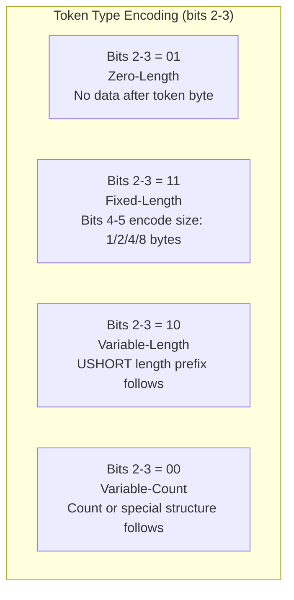

# TDS Token Stream

> Source: [MS-TDS] v20260223, Sections 2.2.7, 2.2.5.8

## 5. Token Stream

Server responses (packet type 0x04) contain token streams. Each token starts with a 1-byte token ID.

### Token IDs

| Token ID | Name | Class | Description |
|----------|------|-------|-------------|
| 0x00 | TVP_END_TOKEN | zero-length | End of TVP column metadata / TVP rows |
| 0x01 | TVP_ROW | zero-length | Table-valued parameter row |
| 0x10 | TVP_ORDER_UNIQUE | variable-count | TVP ordering/uniqueness |
| 0x11 | TVP_COLUMN_ORDERING | variable-count | TVP column ordering |
| 0x78 | OFFSET | fixed (4B) | SQL statement offset (removed TDS 7.2) |
| 0x79 | RETURNSTATUS | fixed (4B) | Return status of RPC |
| 0x81 | COLMETADATA | variable-count | Column metadata for result set |
| 0x88 | ALTMETADATA | variable-count | Alt column metadata (deprecated TDS 7.4) |
| 0xA3 | DATACLASSIFICATION | variable-count | Data sensitivity labels (TDS 7.4) |
| 0xA4 | TABNAME | variable-length | Table name for browse mode |
| 0xA5 | COLINFO | variable-length | Column detail info |
| 0xA9 | ORDER | variable-length | Order information |
| 0xAA | ERROR | variable-length | Error message |
| 0xAB | INFO | variable-length | Informational message |
| 0xAC | RETURNVALUE | variable-count | Return parameter value from RPC |
| 0xAD | LOGINACK | variable-length | Login acknowledgement |
| 0xAE | FEATUREEXTACK | variable-length | Feature extension ack (TDS 7.4) |
| 0xD1 | ROW | variable-count | Row data |
| 0xD2 | NBCROW | variable-count | Row data with null bitmap (TDS 7.3.B+) |
| 0xD3 | ALTROW | variable-count | Alt row data (deprecated TDS 7.4) |
| 0xE3 | ENVCHANGE | variable-length | Environment change |
| 0xE4 | SESSIONSTATE | variable-length | Session state (TDS 7.4) |
| 0xED | SSPI | variable-length | SSPI authentication data |
| 0xEE | FEDAUTHINFO | variable-length | Federated auth info (TDS 7.4) |
| 0xFD | DONE | fixed (12B) | Completion of SQL statement |
| 0xFE | DONEPROC | fixed (12B) | Completion of stored procedure |
| 0xFF | DONEINPROC | fixed (12B) | Completion within stored procedure |

### Token Classes (bit pattern of token byte)



---

## 6. COLMETADATA Token (0x81)

Describes columns in a result set. Must precede ROW/NBCROW tokens.

```
COLMETADATA = 0x81
              Count(USHORT, 2 bytes LE)    ; 0xFFFF = NoMetaData (reuse previous)
              [CekTable]                    ; TDS 7.4, only with Always Encrypted
              *ColumnData                   ; repeated Count times

CekTable    = EkValueCount(USHORT) *EK_INFO

ColumnData  = UserType(ULONG 4 bytes in TDS 7.2+ / USHORT 2 bytes in 7.1)
              Flags(USHORT, 2 bytes)
              TYPE_INFO
              [TableName]                   ; only for text/ntext/image
              [CryptoMetaData]              ; TDS 7.4, when fEncrypted flag set
              ColName(B_VARCHAR)            ; BYTE char_count + UTF-16 LE
```

### TableName (text/ntext/image only)

```
; TDS 7.1 Rev1+
TableName = NumParts(BYTE) 1*PartName(US_VARCHAR)

; TDS 7.0/7.1
TableName = US_VARCHAR
```

### Column Flags (16 bits, LSB order)

| Bit(s) | Mask | Name | Description |
|--------|------|------|-------------|
| 0 | 0x0001 | fNullable | Column allows NULL |
| 1 | 0x0002 | fCaseSen | Case-sensitive collation |
| 2-3 | 0x000C | usUpdateable | 0=readonly, 1=read/write, 2=unknown |
| 4 | 0x0010 | fIdentity | Identity column |
| 5 | 0x0020 | fComputed | Computed column (TDS 7.2) |
| 6-7 | 0x00C0 | usReservedODBC | Reserved (TDS 7.3.A only) |
| 8 | 0x0100 | fFixedLenCLRType | Fixed-length CLR UDT (TDS 7.2) |
| 9 | 0x0200 | fSparseColumn | Sparse column (TDS 7.3.B) |
| 10 | 0x0400 | fSparseColumnSet | Sparse column set XML (TDS 7.3.B) |
| 11 | 0x0800 | fEncrypted | Encrypted (TDS 7.4) |
| 12 | 0x1000 | usReserved2 | Reserved (TDS 7.4) |
| 13 | 0x2000 | fHidden | Hidden PK for FOR BROWSE |
| 14 | 0x4000 | fKey | Part of PK for FOR BROWSE |
| 15 | 0x8000 | fNullableUnknown | Nullable status unknown |

---

## 7. ROW Token (0xD1) and NBCROW Token (0xD2)

### ROW (0xD1)

```
ROW = 0xD1
      *ColumnData    ; one per column from COLMETADATA
```

Each column's data format is determined by TYPE_VARBYTE rules based on the column's TYPE_INFO:

| Category | Length Prefix | NULL Marker |
|----------|-------------|-------------|
| Fixed-length types | None (fixed byte count) | Not nullable (use nullable variant) |
| BYTELEN types | 1-byte length | `0x00` |
| USHORTLEN types | 2-byte LE length | `0xFFFF` |
| LONGLEN types | 4-byte LE length | `0xFFFFFFFF` |
| PLP types | 8-byte total length | `0xFFFFFFFFFFFFFFFF` |

For text/ntext/image columns: TextPointer(B_VARBYTE) + Timestamp(8B) precede data. If TextPointer length = 0x00, the value is NULL and no Timestamp or data follows.

### NBCROW (0xD2) — TDS 7.3.B+

Uses a null bitmap instead of per-column null markers. More efficient when NULLs are present.

```
NBCROW = 0xD2
         NullBitmap     ; ceil(column_count / 8) bytes
         *ColumnData    ; only for non-null columns (in column order, skipping NULLs)
```

**NullBitmap**: One bit per column, LSB first within each byte.
- Bit = **1** → NULL (no data for that column)
- Bit = **0** → NOT NULL (data follows in column order)

Example: 8 columns, columns 2 and 5 are NULL (0-indexed):
```
Bit positions: [col0=0, col1=0, col2=1, col3=0, col4=0, col5=1, col6=0, col7=0]
Bitmap byte = 0b00100100 = 0x24
```

ROW and NBCROW tokens can be intermixed in the same result set. NBCROW MUST NOT be used in BulkLoadBCP streams.

---

## 8. DONE / DONEPROC / DONEINPROC Tokens

| Token | ID | Description |
|-------|-----|-------------|
| DONE | 0xFD | End of SQL statement |
| DONEPROC | 0xFE | End of stored procedure |
| DONEINPROC | 0xFF | End of statement within stored procedure |

### Structure (identical for all three)

```
Token(1B) + Status(USHORT 2B LE) + CurCmd(USHORT 2B LE) + DoneRowCount(ULONGLONG 8B LE)
```

Total after token byte: **12 bytes** (TDS 7.2+) or **8 bytes** (TDS 7.0/7.1, DoneRowCount is LONG 4B).

Note: To detect DoneRowCount size — if negotiated TDS is 7.0 or 7.1, use LONG (4B). For 7.2+, use ULONGLONG (8B). SNAC/SqlClient use the VERSION in PreLogin response to detect: LONG if server is SQL Server 7.0 or 2000.

### Status Flags

| Value | Name | Description |
|-------|------|-------------|
| 0x0000 | DONE_FINAL | Final DONE in request (no more results) |
| 0x0001 | DONE_MORE | More result sets / commands follow |
| 0x0002 | DONE_ERROR | Error occurred in this statement |
| 0x0004 | DONE_INXACT | Transaction is in progress (**NOT set by SQL Server** — reserved) |
| 0x0010 | DONE_COUNT | DoneRowCount is valid (meaningful) |
| 0x0020 | DONE_ATTN | Attention acknowledgement (cancel response) |
| 0x0080 | DONE_RPCINBATCH | DONEPROC only: RPC in batch (more RPCs follow) |
| 0x0100 | DONE_SRVERROR | Severe error — client should discard result set |

### Important Rules

- DONE_FINAL (status & 0x0001 == 0) signals the very last DONE in a response
- Always read tokens until you see DONE without DONE_MORE
- For attention acknowledgement: look for DONE with DONE_ATTN (0x0020) set
- DONEPROC uses DONE_RPCINBATCH (0x0080) to indicate more RPCs in a batch
- DONEINPROC is emitted for each statement within a stored procedure

---

## 9. ENVCHANGE Token (0xE3)

Notifies client of environment/state changes.

```
ENVCHANGE = 0xE3 Length(USHORT LE) Type(BYTE) EnvValueData
```

### Type Values

| Type | Name | NewValue | OldValue |
|------|------|----------|----------|
| 1 | Database | B_VARCHAR (name) | B_VARCHAR (old name) |
| 2 | Language | B_VARCHAR | B_VARCHAR |
| 3 | Character Set | B_VARCHAR | B_VARCHAR (TDS 7.0 only) |
| 4 | Packet Size | B_VARCHAR (size as string) | B_VARCHAR |
| 5 | Unicode Sorting Locale ID | B_VARCHAR | 0x00 (TDS 7.0 only) |
| 6 | Unicode Comparison Flags | B_VARCHAR | 0x00 (TDS 7.0 only) |
| 7 | SQL Collation | B_VARBYTE (5 bytes) | B_VARBYTE |
| 8 | Begin Transaction | B_VARBYTE (8B descriptor) | 0x00 |
| 9 | Commit Transaction | 0x00 | B_VARBYTE (8B old descriptor) |
| 10 | Rollback Transaction | 0x00 | B_VARBYTE (8B old descriptor) |
| 11 | Enlist DTC Transaction | 0x00 | B_VARBYTE |
| 12 | Defect Transaction | B_VARBYTE | 0x00 |
| 13 | Database Mirroring Partner | B_VARCHAR | 0x00 |
| 15 | Promote Transaction | L_VARBYTE | 0x00 |
| 16 | Transaction Manager Address | B_VARBYTE | 0x00 |
| 17 | Transaction Ended | 0x00 | B_VARBYTE |
| 18 | Reset Completion Ack | 0x00 | 0x00 |
| 19 | User Instance Info | B_VARCHAR | 0x00 |
| 20 | Routing | RoutingData | 0x00 0x00 |
| 21 | Enhanced Routing | RoutingData + AlternateDB | 0x00 0x00 (TDS 7.4) |

### Data Format Definitions

```
B_VARCHAR  = length_byte(1B) + UTF-16 LE data (length_byte × 2 bytes)  ; length in CHARACTERS
B_VARBYTE  = length_byte(1B) + raw bytes (length_byte bytes)            ; length in BYTES
L_VARBYTE  = length_long(4B LE) + raw bytes
```

### Transaction Types (8, 9, 10)

- **Type 8 (Begin)**: NewValue = 8-byte transaction descriptor (used in ALL_HEADERS for subsequent requests); OldValue = 0x00
- **Type 9 (Commit)**: NewValue = 0x00; OldValue = old 8-byte descriptor. If auto-begin, server may include new descriptor.
- **Type 10 (Rollback)**: Same format as commit.

The transaction descriptor from type 8 MUST be included in ALL_HEADERS Transaction Descriptor header for all subsequent SQLBatch/RPC/TransMgr requests.

### Routing (Type 20)

```
NewValue = RoutingData:
  Protocol(BYTE)              ; 0x00 = TCP
  ProtocolProperty(USHORT LE) ; port number
  AlternateServer(US_VARCHAR) ; server hostname
```

OldValue = `0x00 0x00`. Only one of Type 20 or Type 21 may be sent per login response.

### Enhanced Routing (Type 21, TDS 7.4)

Same as Type 20 but also includes `AlternateDatabase(B_VARCHAR)` after AlternateServer. Only sent if client included ENHANCEDROUTINGSUPPORT in FeatureExt.

### ENVCHANGE Notes

- Types 3, 5, 6: only sent to TDS 7.0 clients
- Types 8, 9, 10, 11, 12: only for explicit/implicit transactions (NOT auto-commit)
- Type 16: Transaction Manager Address — not used by SQL Server
- Type 19: sent **before** LOGINACK token
- Type 20/21: sent **after** LOGINACK in login response
- DONE_INXACT (0x0004) is NOT set by SQL Server — reserved for future use

---

## 10. ERROR Token (0xAA) and INFO Token (0xAB)

Both have identical structure.

```
Token(1B) Length(USHORT LE) Number(LONG 4B LE) State(BYTE) Class(BYTE)
MsgText(US_VARCHAR)
ServerName(B_VARCHAR)
ProcName(B_VARCHAR)
LineNumber(LONG 4B LE in TDS 7.2+ / USHORT 2B in older)
```

### Error Severity Classes

| Class | Severity | Description |
|-------|----------|-------------|
| 0-9 | Informational | Used with INFO token (0xAB) |
| 10 | Informational | SQL Server converts to severity 0 before returning |
| 11 | Object not found | |
| 12 | Locking issue | Unused by SQL Server |
| 13 | Deadlock | Transaction deadlock |
| 14 | Security/permission | Permission denied |
| 15 | SQL syntax error | |
| 16 | General user-correctable | |
| 17 | Out of resources | Insufficient resources |
| 18 | Non-fatal internal | Software problem detected |
| 19 | Fatal resource limit | Non-configurable resource limit exceeded |
| 20 | Fatal — current process | Error in current process |
| 21 | Fatal — all processes | Error affecting all processes |
| 22 | Fatal — table integrity | Table/index integrity suspect |
| 23 | Fatal — database integrity | Database integrity suspect |
| 24 | Fatal — hardware | Hardware error |
| 25 | Fatal — system error | |

Error numbers < 20001 are reserved by SQL Server.

---

## 11. LOGINACK Token (0xAD)

Sent by server on successful login.

```
LOGINACK = 0xAD Length(USHORT LE)
           Interface(BYTE)        ; 0=SQL_DFLT, 1=SQL_TSQL
           TDSVersion(DWORD 4B)   ; Server-to-client format (bytes reversed)
           ProgName(B_VARCHAR)    ; Server name (e.g., "Microsoft SQL Server")
           MajorVer(BYTE) MinorVer(BYTE) BuildNumHi(BYTE) BuildNumLow(BYTE)
```

---

## 12. RETURNSTATUS Token (0x79)

Return value of a stored procedure. Fixed-length token.

```
RETURNSTATUS = 0x79 Value(LONG, 4 bytes LE, signed)
```

---

## 23. RETURNVALUE Token (0xAC)

Return parameter from stored procedure. **Note: No Length prefix** (unlike LOGINACK).

```
RETURNVALUE = 0xAC
              ParamOrdinal(USHORT LE)
              ParamName(B_VARCHAR)
              Status(BYTE)           ; 0x01=OUTPUT, 0x02=UDF return value
              UserType(ULONG 4B LE in TDS 7.2+ / USHORT 2B in 7.1)
              Flags(USHORT LE)
              TYPE_INFO
              [CryptoMetaData]       ; TDS 7.4, only when column encryption enabled
              Value(TYPE_VARBYTE)
```

---

## 26. FEATUREEXTACK Token (0xAE, TDS 7.4)

Server acknowledges negotiated features from Login7 FeatureExt.

```
FEATUREEXTACK = 0xAE *(FeatureAckOpt) TERMINATOR(0xFF)

FeatureAckOpt = FeatureId(1B) FeatureAckDataLen(DWORD 4B LE) FeatureAckData
```

### Feature Ack IDs and Data

| FeatureId | Name | FeatureAckData |
|-----------|------|----------------|
| 0x01 | SESSIONRECOVERY | SessionStateDataSet (session state key-value pairs) |
| 0x02 | FEDAUTH | FedAuthToken(variable) + [Nonce(32B)] + [Signature(32B)] |
| 0x04 | COLUMNENCRYPTION | Version(1B). 0x01=AE v1, 0x02=AE v2 w/ enclave |
| 0x05 | GLOBALTRANSACTIONS | 0x01 (supported) |
| 0x07 | AZURESQLDNSCACHING | (empty) |
| 0x08 | AZURESQLSUPPORT | 0x01 (supported) |
| 0x09 | DATACLASSIFICATION | Version(1B) |
| 0x0A | UTF8SUPPORT | 0x01 (supported) |
| 0x0B | VECTORSUPPORT | 0x01 (supported) |
| 0x0C | JSONSUPPORT | 0x01 (supported) |
| 0x0E | ENHANCEDROUTINGSUPPORT | (empty) |
| 0x0F | USERAGENT | (empty or ack data) |
| 0xFF | TERMINATOR | End of feature list |

---

## 27. SESSIONSTATE Token (0xE4, TDS 7.4)

Session state for connection recovery. Only sent when SESSIONRECOVERY is negotiated.

```
SESSIONSTATE = 0xE4
               Length(DWORD 4B LE)           ; total length of body
               SeqNo(DWORD 4B LE)           ; monotonically increasing sequence
               Status(BYTE)                  ; bit 0 = fRecoverable
               1*SessionStateData

SessionStateData = StateId(BYTE)
                   StateLen                   ; if 0x00-0xFE: 1 byte
                                              ; if 0xFF: next DWORD(4B) is actual length
                   StateValue(*BYTE)
```

Known StateId values:

| StateId | Name |
|---------|------|
| 0x00 | ISO_SET (date format, language, etc.) |
| 0x02 | Isolation level |
| 0x04 | ANSI_NULLS |
| 0x05 | Deadlock priority |
| 0x06 | SET options |
| 0x07 | SET options 2 |
| 0x08 | Transaction descriptor |
| 0x09 | Row count / identity last value |

The next token after SESSIONSTATE MUST be DONE or DONEPROC with DONE_FINAL.

---

## 28. DATACLASSIFICATION Token (0xA3, TDS 7.4)

Data sensitivity classification. Sent before COLMETADATA. **No length prefix** (variable-count token).

```
DATACLASSIFICATION = 0xA3
    SensitivityLabelCount(USHORT)
    *SensitivityLabel                     ; each = Name(B_VARCHAR) + Id(B_VARCHAR)
    InformationTypeCount(USHORT)
    *InformationType                      ; each = Name(B_VARCHAR) + Id(B_VARCHAR)
    [SensitivityRank(LONG)]               ; overall rank (version 2 only)
    NumResultSetColumns(USHORT)
    *ColumnSensitivityMetadata

ColumnSensitivityMetadata = NumProps(USHORT) *SensitivityProperty
SensitivityProperty       = LabelIndex(USHORT) TypeIndex(USHORT) [Rank(LONG)]
```

---

## 29. ORDER Token (0xA9)

Column ordering info for ORDER BY.

```
ORDER = 0xA9 Length(USHORT LE) *ColNum(USHORT LE)
```

One USHORT per column in ORDER BY. Length = total bytes of ColNums.

---

## 30. COLINFO Token (0xA5)

Column detail info for browse mode, sp_cursoropen, sp_cursorfetch.

```
COLINFO = 0xA5 Length(USHORT LE) 1*ColProperty

ColProperty = ColNum(BYTE) TableNum(BYTE) Status(BYTE) [ColName(B_VARCHAR)]
```

Status bit 5 (0x20): fDifferentName — if set, ColName follows with the real column name.

---

## 31. TABNAME Token (0xA4)

Table name(s) for browse mode.

```
TABNAME = 0xA4 Length(USHORT LE) *TableName

TableName = NumParts(BYTE) 1*PartName(US_VARCHAR)     ; TDS 7.1 Rev1+
          / US_VARCHAR                                  ; TDS 7.0/7.1
```

---

## 32. SSPI Token (0xED)

Server-to-client SPNEGO/SSPI authentication data during login.

```
SSPI = 0xED SSPIBuffer(US_VARBYTE)    ; USHORT length + raw bytes
```

---

## 33. FEDAUTHINFO Token (0xEE, TDS 7.4)

Federated authentication info (Azure). Must be the only token in its message (followed by DONE).

```
FEDAUTHINFO = 0xEE
              TokenLength(DWORD LE)
              CountOfInfoIDs(DWORD LE)
              1*FedAuthInfoOpt
              FedAuthInfoData(*BYTE)

FedAuthInfoOpt = InfoID(BYTE) DataLen(DWORD LE) DataOffset(DWORD LE)
```

| InfoID | Name | Data |
|--------|------|------|
| 0x01 | STSURL | Security Token Service URL (WCHAR string) |
| 0x02 | SPN | Service Principal Name (WCHAR string) |

DataOffset is relative to start of FedAuthInfoData (after all FedAuthInfoOpt entries).

---

## 34. ALTMETADATA Token (0x88) — Deprecated

```
ALTMETADATA = 0x88 Length(USHORT) Id(USHORT) ByCols(BYTE) *OpByCol(USHORT) *ComputeData
```

Only supported in SQL Server 7.0 through 2008 R2. Removed in SQL Server 2012+.

---

## 35. ALTROW Token (0xD3) — Deprecated

```
ALTROW = 0xD3 Id(USHORT) *ComputeColumnData
```

Id matches an Id from a preceding ALTMETADATA token. Removed in SQL Server 2012+.
